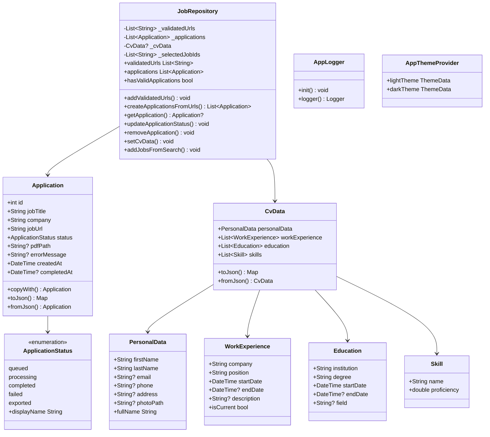
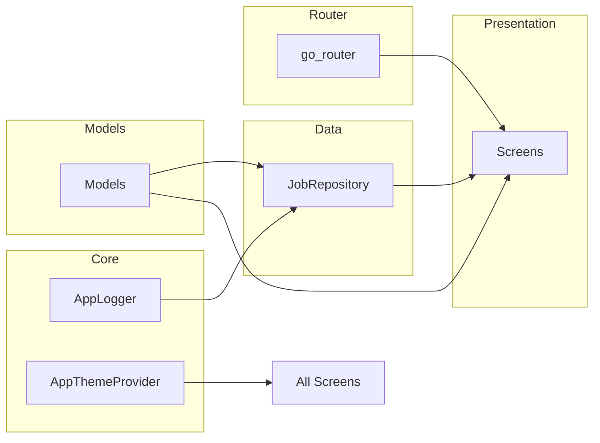

# Architecture

## Overview

Job-O-Matic is a Flutter application following a **Riverpod-based architecture** with clear separation of concerns. The architecture follows a simplified Clean Architecture pattern adapted for Flutter:

```
┌─────────────────────────────────────────────┐
│                PRESENTATION                  │
│  (Screens, Widgets, UI Logic)               │
├─────────────────────────────────────────────┤
│                   ROUTER                     │
│  (go_router – Navigation & Redirects)       │
├─────────────────────────────────────────────┤
│                    DATA                      │
│  (Repositories, Services, State Mgmt)       │
├─────────────────────────────────────────────┤
│                   MODELS                     │
│  (Application, CvData, Enums)               │
├─────────────────────────────────────────────┤
│                   CORE                       │
│  (Logging, Theme, Utilities)                │
└─────────────────────────────────────────────┘
```

## Layer Responsibilities

### 1. Core Layer (`lib/core/`)
Base infrastructure used by all other layers.

| Component | Responsibility |
|-----------|---------------|
| `AppLogger` | Centralized logging with 4 levels, file rotation, module-specific filtering |
| `AppThemeProvider` | Material 3 light/dark themes with red seed color |

### 2. Models Layer (`lib/models/`)
Pure Dart data classes without dependencies.

| Model | Fields |
|-------|--------|
| `Application` | id, jobTitle, company, jobUrl, status, pdfPath, errorMessage, createdAt, completedAt |
| `ApplicationStatus` | Enum: queued, processing, completed, failed, exported |
| `PersonalData` | firstName, lastName, email, phone, address, photoPath |
| `WorkExperience` | company, position, startDate, endDate, description |
| `Education` | institution, degree, startDate, endDate, field |
| `Skill` | name, proficiency (0.0–1.0) |
| `CvData` | personalData + lists of WorkExperience, Education, Skill |

### 3. Data Layer (`lib/data/`)
State management and business logic via Riverpod.

| Component | Responsibility |
|-----------|---------------|
| `JobRepository` | Central state store: URLs, Applications, CV data, search results |
| `jobRepositoryProvider` | Riverpod Provider for dependency injection |

### 4. Router Layer (`lib/router/`)
Navigation management.

| Component | Responsibility |
|-----------|---------------|
| `goRouterProvider` | go_router instance with 4 routes + redirect guard |
| Redirect Guard | Blocks `/applications` if no validated data exists |

### 5. Presentation Layer (`lib/presentation/screens/`)
Flutter widgets/screens.

| Screen | Route | Purpose |
|--------|-------|---------|
| `JobInputScreen` | `/` | URL input with validation |
| `JobSearchScreen` | `/search` | Job search with filters |
| `ApplicationListScreen` | `/applications` | Application overview with status |
| `ApplicationDetailScreen` | `/applications/:id` | Single application detail view |

---

## Class Diagram (Dart Classes)



---

## Dependency Diagram



---

## File Tree (Flutter Project)

```
job_o_matic/
├── lib/
│   ├── main.dart                          # App entry point
│   ├── core/
│   │   ├── logging/
│   │   │   └── app_logger.dart            # Logging system
│   │   └── theme/
│   │       └── app_theme_provider.dart    # Theme definitions
│   ├── models/
│   │   ├── application.dart               # Application + Status enum
│   │   └── cv_data.dart                   # CV data classes
│   ├── data/
│   │   └── repositories/
│   │       └── job_repository.dart        # Central state store
│   ├── router/
│   │   └── app_router.dart                # Navigation routes
│   └── presentation/
│       └── screens/
│           ├── job_input_screen.dart       # Screen 1
│           ├── job_search_screen.dart      # Screen 2
│           ├── application_list_screen.dart # Screen 3
│           └── application_detail_screen.dart # Screen 3a
├── test/
│   └── widget_test.dart                   # Widget tests
├── pubspec.yaml                           # Dependencies
└── assets/                                # Theme, CV data, templates