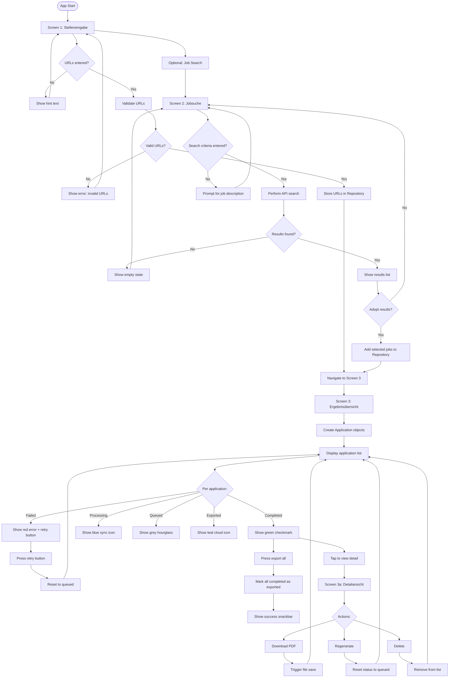
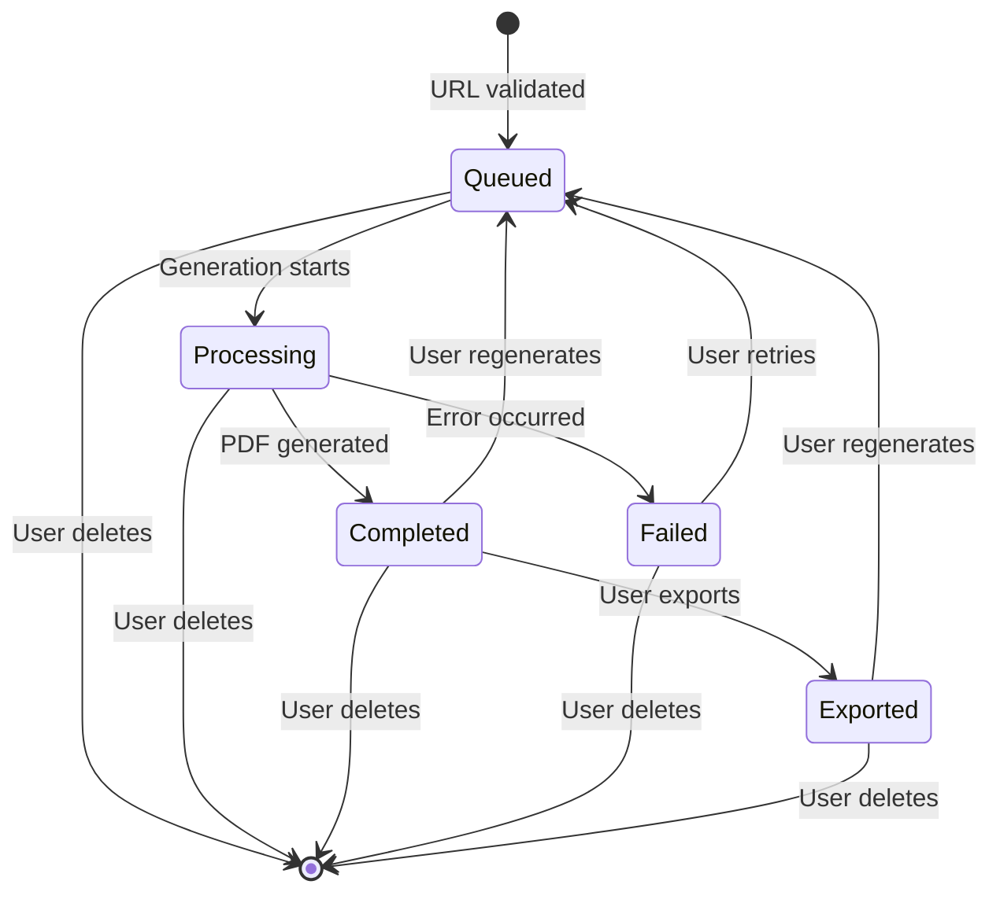
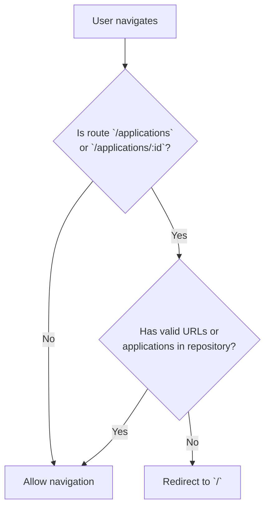
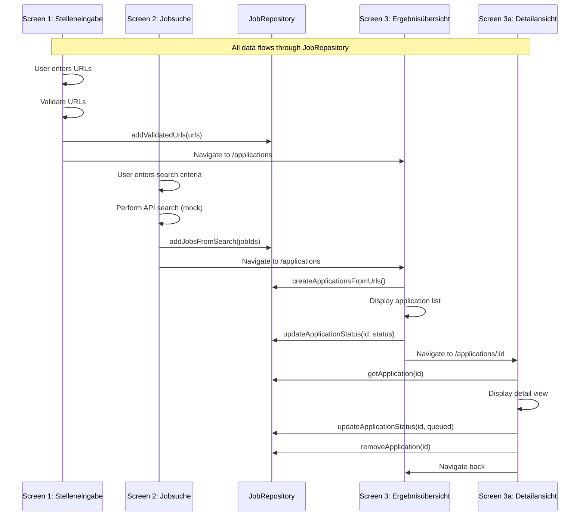

# Flow Diagrams

## 1. Application Workflow (User's Perspective)

This diagram shows the complete user journey through the app, from entering job URLs to exporting the final PDF.



## 2. State Flow (Application Lifecycle)

Each application goes through a defined lifecycle:



### Status Descriptions

| Status | Icon | Color | Meaning |
|--------|------|-------|---------|
| **Queued** | `hourglass_empty` | Grey | Awaiting processing |
| **Processing** | `sync` | Blue | Generation in progress |
| **Completed** | `check_circle` | Green | PDF ready |
| **Failed** | `error` | Red | Error occurred, retry available |
| **Exported** | `cloud_done` | Teal | PDF has been exported |

## 3. Navigation Flow (go_router)

```mermaid
flowchart LR
    A["`/`<br/>Stelleneingabe`"] -->|"Weiter"| C["`/applications`<br/>Ergebnisübersicht`"]
    A -->|"Jobsuche"| B["`/search`<br/>Jobsuche`"]
    B -->|"Übernehmen"| C
    C -->|"Zurück"| A
    C -->|"Zurück"| B
    C -->|"Tippen"| D["`/applications/:id`<br/>Detailansicht`"]
    D -->|"Zurück"| C

    style A fill:#bbdefb
    style B fill:#c8e6c9
    style C fill:#fff9c4
    style D fill:#f8bbd0
```

### Redirect Guard Logic



## 4. Data Flow (Screen to Screen)



## 5. Logging Flow

```mermaid
flowchart LR
    A[App Event] --> B[Module-Specific Logger]
    B --> C{Log Level?}

    C -->|ERROR| D[Logger.severe()]
    D --> E[Console output]
    D --> F[File output (production)]

    C -->|WARNING| G[Logger.warning()]
    G --> E
    G --> F

    C -->|INFO| H[Logger.info()]
    H --> E
    H --> F

    C -->|DEBUG| I[Logger.fine()]
    I --> E
    I --> F

    F --> J[app_log.txt]
    J --> K{Rotation needed?}
    K -->|> 5 MB| L[Rotate to .0, .1, .2]
    K -->|<= 5 MB| M[Keep writing]

    style D fill:#ffcdd2
    style G fill:#fff9c4
    style H fill:#c8e6c9
    style I fill:#e0e0e0
```

### Log Level Configuration by Environment

| Environment | Log Level | Output |
|-------------|-----------|--------|
| **Development** | `Level.ALL` (DEBUG) | Console only |
| **Test / UAT** | `Level.INFO` | Console + File |
| **Production** | `Level.WARNING` | File only |

## 6. Complete System Interaction

```mermaid
flowchart TD
    subgraph "User Interface"
        A["`Stelleneingabe<br/>Screen 1`"]
        B["`Jobsuche<br/>Screen 2`"]
        C["`Ergebnisübersicht<br/>Screen 3`"]
        D["`Detailansicht<br/>Screen 3a`"]
    end

    subgraph "Data Layer"
        E["`JobRepository<br/>(Riverpod Provider)`"]
    end

    subgraph "Core Services"
        F["`AppLogger<br/>(Logging)`"]
        G["`AppThemeProvider<br/>(Theme)`"]
    end

    subgraph "External"
        H["`Job APIs<br/>(future)`"]
        I["`File System<br/>(PDF storage)`"]
    end

    A -->|validate + store URLs| E
    B -->|store search results| E
    E -->|read applications| C
    E -->|read single app| D
    C -->|status updates| E
    D -->|update / delete| E

    A -->|"Option: Search"| B

    F -.->|logging| A
    F -.->|logging| B
    F -.->|logging| C
    F -.->|logging| D
    F -.->|logging| E

    G -.->|theme| A
    G -.->|theme| B
    G -.->|theme| C
    G -.->|theme| D

    H -..->|search results| B
    C -.->|export PDFs| I