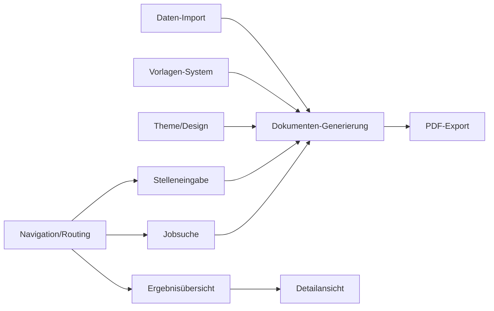

# Workflow

Dieses Dokument beschreibt den grundlegenden Arbeitsablauf des Projekts – von den Voraussetzungen über die Bildschirm-Navigation bis zur tatsächlichen Umsetzung.

---

## Voraussetzungen

Bevor mit der Entwicklung begonnen werden kann, müssen folgende Voraussetzungen erfüllt sein:

| Nr. | Voraussetzung | Beschreibung |
|-----|---------------|-------------|
| 1 | **Flutter SDK** | Mindestens Flutter 3.x installiert und konfiguriert (`flutter doctor` erfolgreich) |
| 2 | **Projekt-Setup** | Flutter-Projekt wurde via `flutter create` angelegt (siehe `0-Grundidee.md`, Phase 0) |
| 3 | **Theme-Daten** | App-Theme aus `assets/theme` liegt bereit und ist ins Projekt eingebunden |
| 4 | **Bewerbungsdaten** | Persönliche Daten, Werdegang, Qualifikationen unter `assets/mydata/cv` vorhanden |
| 5 | **Vorlagen** | Formatvorlagen für Deckblatt, Anschreiben und Lebenslauf unter `assets/mydata/vorlagen` abgelegt |
| 6 | **Abhängigkeiten** | Alle relevanten Pakete in `pubspec.yaml` definiert (pdf_generator, http, riverpod, freezed, etc.) |

---

## Bildschirme (User Interface)

Die Anwendung besteht aus drei Hauptbildschirmen sowie einer Detailansicht (definiert in `1-AppBasis.md`):

| Bildschirm | Route | Zweck |
|------------|-------|-------|
| **Screen 1 – Stelleneingabe** | `/` | Eingabe von Stellen-URLs (einzeilig oder mehrzeilig) |
| **Screen 2 – Jobsuche** | `/search` | Suche nach Stellen via Suchmaschinen mit Filterkriterien |
| **Screen 3 – Ergebnisübersicht** | `/applications` | Liste aller generierten Bewerbungen mit Status |
| **Screen 3a – Detailansicht** | `/applications/:id` | Einzelansicht einer Bewerbung mit PDF-Vorschau |

Die Navigation erfolgt über `go_router` (declaratives Routing). Die Datenweitergabe zwischen den Screens wird über einen zentralen Zustandsmanager (Riverpod/Cubit) realisiert – nicht über `Navigator.push`-Argumente.

### Navigationsdiagramm

```
                    ┌──────────────────┐
                    │                  │
       ┌───────────►│  Stelleneingabe  │◄───────────┐
       │            │    (Screen 1)    │            │
       │            │        │         │            │
       │            │        ▼         │            │
       │            │   [Weiter]       │            │
       │            │        │         │            │
       │            │        ▼         │            │
       │            └────────┼─────────┘            │
       │                     │                      │
       │                     ▼                      │
       │            ┌──────────────────┐            │
       │            │                  │            │
       │            │ Ergebnisübersicht│            │
       └────────────┤   (Screen 3)     ├────────────┘
       (Zurück)     │   │          ▲   │  (Zurück)
                    │   ▼          │   │
                    │ [Tippen]─────┘   │
                    │   │              │
                    │   ▼              │
                    │ Detailansicht    │
                    │  (Screen 3a)     │
                    └──────────────────┘

       ┌──────────────────┐
       │                  │
       │    Jobsuche      ├───────(Übernehmen)──► Ergebnisübersicht
       │   (Screen 2)     │
       └────────┬─────────┘
                │
         (Zurück nach /)
```

### Statusmodell der Bewerbungen

Jede Bewerbung durchläuft während der Generierung folgende Phasen:

| Status | Beschreibung |
|--------|-------------|
| **Wartend (queued)** | Die Bewerbung wurde zur Generierung vorgemerkt, der Prozess läuft noch nicht |
| **In Bearbeitung (processing)** | Die Generierung läuft (Scraping, Anschreiben-Erstellung, Zusammenführung) |
| **Generierung fehlgeschlagen (failed)** | Bei einem Fehler (z. B. URL nicht erreichbar, Parsing-Fehler) mit Fehlermeldung |
| **Generierung abgeschlossen (completed)** | Die Bewerbung liegt vollständig vor und kann begutachtet werden |
| **Exportiert (exported)** | Die Bewerbung wurde heruntergeladen; Informationsstatus, blockiert die Liste nicht |

Fehlgeschlagene Bewerbungen können manuell erneut gestartet werden, ohne dass die gesamte Stapelverarbeitung wiederholt werden muss.

### Datenfluss zwischen den Screens

| Übergang | Daten | Mechanismus |
|---|---|---|
| Screen 1 → Screen 3 | Validierte URL-Liste (`List<String>`) | Nach Validierung in `JobRepository` speichern → Screen 3 liest aus selber Quelle |
| Screen 2 → Screen 3 | Ausgewählte Job-IDs (`List<String>`) | Übernommene Jobs in `JobRepository` hinzufügen → Screen 3 aktualisiert |
| Screen 3 → Screen 3a | `int applicationId` | Pfadparameter `:id` im Route-Pfad |
| Screen 3 → Screen 1 / Screen 2 (via "Zurück") | (keine) | Einfache Navigation zurück; Zustand bleibt erhalten (Autosave) |

---

## Umsetzung

Die Umsetzung erfolgt in mehreren Phasen, die weitgehend unabhängig voneinander bearbeitet werden können:

### 1. Daten-Import & Validierung
- Einlesen der CV-Daten aus `assets/mydata/cv` (JSON/YAML)
- Parsen und Deserialisieren in definierte Datenmodelle (`PersonalData`, `WorkExperience`, `Education`, `Skill`)
- Validierung der Pflichtfelder und Datumslogik
- Fehlerbehandlung für fehlende oder fehlerhafte Dateien

### 2. Vorlagen-System
- Laden der Formatvorlagen aus `assets/mydata/vorlagen`
- Integration einer Template-Engine für Platzhalter-Ersetzung (`{{name}}`, `{{position}}`, etc.)
- Bereitstellung einer Default-Vorlage als Fallback

### 3. UI-Screens (Frontend)
- **Stelleneingabe (Screen 1):** Textarea für URLs, Live-Validierung, Autosave, Persistenz der validierten URLs in lokaler Datenbank
- **Jobsuche (Screen 2):** Suchmaske mit Jobbeschreibung, Ort, Umkreis-Slider; erweiterte Filter (Arbeitszeitmodell, Remote, Firma, Beschäftigungsart, Gehalt); Anbindung an Job-APIs; Visualisierung der Skill-Übereinstimmung (Balkendiagramm mit Farbskala)
- **Ergebnisübersicht (Screen 3):** Statusleiste mit Gesamtfortschritt, Ergebnisliste mit Status-Icons, Batch-Export als ZIP
- **Detailansicht (Screen 3a):** PDF-Vorschau, Download, erneute Generierung, Metadaten-Anzeige
- **Navigation:** `go_router` mit Redirect-Guards, `PopScope` zum Schutz laufender Prozesse, Zustandserhaltung bei Navigation

### 4. Dokumenten-Generierung
- Erstellung von **Deckblatt**, **Anschreiben** und **Lebenslauf** pro Stellenangebot
- Personalisierung der Inhalte basierend auf den importierten Daten
- Export als **PDF** mittels geeigneter Dart/Flutter-Pakete (z. B. `pdf`/`printing`)
- PDF-Generierung in separatem Isolate zur Vermeidung von UI-Blockaden
- Retry-Mechanismus (exponentieller Backoff, max. 3 Versuche) bei flüchtigen Fehlern

### 5. Integration & Orchestrierung
- Zusammenspiel der Module in einem zentralen `GenerateUseCase`
- URL-Parsing → Datenabgleich → Dokumenten-Generierung als durchgehende Pipeline
- Deduplizierung anhand der Job-URL bei paralleler Eingabe über Screen 1 und Screen 2
- Persistenz: lokale SQLite-Datenbank (`sqflite`) für Bewerbungsstatus; PDF-Dateien im App-Dokumentenverzeichnis
- Speicherbereinigung: Löschen alter PDFs bei Neugenerierung; Cleanup-Job für verwaiste Dateien beim App-Start

### 6. Logsystem

Ein zentrales Logsystem stellt sicher, dass alle relevanten Ereignisse im Workflow dokumentiert werden – für Fehlerdiagnose, Nachvollziehbarkeit und spätere Optimierung.

#### Log-Level

| Level | Verwendung | Dart-Äquivalent (z. B. `logging`-Paket) |
|-------|-----------|----------------------------------------|
| **ERROR** | Fehler, die die Generierung abbrechen (Scraping-Fehler, Parsing-Fehler, API-Timeouts) | `Level.SEVERE` |
| **WARNING** | Auffälligkeiten ohne Abbruch (z. B. fehlende optionale Felder, API-Rate-Limit erreicht, erneuter Generierungsversuch) | `Level.WARNING` |
| **INFO** | Normale Workflow-Schritte (Validierung gestartet/abgeschlossen, PDF erstellt, Export erfolgreich) | `Level.INFO` |
| **DEBUG** | Detaillierte Diagnose-Informationen (URL-Normalisierung, API-Request/Response (gekürzt), Zwischenergebnisse) | `Level.FINE` / `Level.FINER` |

#### Log-Inhalte (pro Workflow-Schritt)

| Schritt | Log-Level | Inhalt |
|---------|-----------|--------|
| **URL-Eingabe & Validierung** | INFO | Anzahl eingegebener URLs, Anzahl gültiger/ungültiger URLs, Dauer der Validierung |
| **URL-Parsing (Screen 1 → Screen 3)** | DEBUG | Normalisierte URL, extrahierte Job-ID |
| **Job-Suche (API-Anfrage)** | INFO | Suchkriterien (Jobbeschreibung, Ort, Umkreis), Anzahl Ergebnisse |
| **Job-Suche (API-Fehler)** | ERROR | HTTP-Status, Fehlermeldung, betroffene Suchmaschine |
| **Job-Übernahme (Screen 2 → Screen 3)** | INFO | Anzahl übernommener Jobs, davon neu vs. duplikatsgefiltert |
| **Generierung gestartet (pro Job)** | INFO | Jobtitel, Unternehmen, URL |
| **Generierung abgeschlossen (pro Job)** | INFO | Jobtitel, Unternehmen, Dateigröße der PDF, Dauer |
| **Generierung fehlgeschlagen (pro Job)** | ERROR | Jobtitel, Unternehmen, Fehlermeldung (inkl. Stacktrace), fehlgeschlagener Schritt |
| **Retry-Versuch** | WARNING | Jobtitel, Versuch-Nummer, Fehlergrund |
| **Batch-Export** | INFO | Anzahl exportierter PDFs, Zielpfad, Gesamtgröße des ZIP-Archivs |
| **Dateibereinigung (Cleanup)** | INFO | Anzahl gelöschter/verwaister Dateien, freigegebener Speicherplatz |

#### Technische Umsetzung

- **Paket:** Verwendung des `logging`-Pakets aus dem Dart SDK (keine externe Abhängigkeit für das Grundgerüst)
- **Logger-Instanz:** Zentrale `Logger`-Instanz mit konfigurierbarem Level (z. B. `Logger.root.level = Level.ALL` für Debug-Builds, `Level.INFO` für Produktion)
- **Output-Handler:** Standardmäßig Ausgabe über `debugPrint()` (für Flutter) in der Entwicklung; optional Datei-Logging über `FileLogHandler` in Produktion
- **Log-Datei-Rotation:** Maximale Log-Dateigröße 5 MB, bei Überschreitung Rotation (max. 3 Backup-Dateien). Log-Verzeichnis: App-Cache-Ordner (`getApplicationCacheDirectory()`)
- **Filterung:** Der Logger kann pro Modul/Feature konfiguriert werden, z. B. `Logger("JobSearchAPI")` nur auf WARNING-Level, während `Logger("PDFGeneration")` auf INFO-Level bleibt
- **Strukturierte Logs (optional):** Bei Datei-Logging JSON-Format mit Feldern: `timestamp`, `level`, `logger`, `message`, `stackTrace` (optional), `duration` (optional)

#### Beispiel (Dart-Code-Gerüst)

```dart
import 'package:logging/logging.dart';

final log = Logger('Workflow');

void _logGenerationStart(String jobTitle, String company) {
  log.info('Generierung gestartet: $jobTitle bei $company');
}

void _logGenerationSuccess(String jobTitle, String company, int fileSize, Duration duration) {
  log.info('Generierung abgeschlossen: $jobTitle bei $company'
      ' (${fileSize ~/ 1024} KB, ${duration.inSeconds}s)');
}

void _logGenerationError(String jobTitle, String company, Object error, StackTrace stack) {
  log.severe('Generierung fehlgeschlagen: $jobTitle bei $company – $error', error, stack);
}
```

#### Integration in den Workflow

- **Entwicklung:** DEBUG-Level aktiv, Ausgabe in der IDE-Konsole
- **Test/UAT:** INFO-Level aktiv, Ausgabe in Datei und Konsole
- **Produktion:** WARNING-Level aktiv, nur Datei-Logging (aus Datenschutzgründen keine sensiblen Nutzerdaten loggen)

---

## Parallelisierbare Arbeiten

Die folgenden Bereiche können zeitgleich bearbeitet werden, da sie keine Abhängigkeiten zueinander haben:

- **Daten-Import & Validierung** und **Vorlagen-System** sind voneinander unabhängig
- **Theme & Design-System** (Phase 1 aus `0-Grundidee.md`) kann parallel zu den anderen Phasen laufen
- **UI-Screens** können parallel zur Backend-Entwicklung (Daten-Import, Vorlagen) realisiert werden
- **Qualitätssicherung** (Tests, CI/CD) sollte begleitend ab der zweiten Phase starten

---

## Abhängigkeiten



*Hinweis: Dieses Diagramm veranschaulicht die Abhängigkeiten zwischen den Komponenten. Die Dokumenten-Generierung bildet den zentralen Knotenpunkt, während die UI-Screens parallel zu den Backend-Komponenten entwickelt werden können.*

---

## Nächste Schritte

1. [ ] `flutter pub get` ausführen und Abhängigkeiten prüfen
2. [ ] Routing mit `go_router` aufsetzen (Routen-Tabelle, Redirect-Guards, Navigationsdiagramm)
3. [ ] Datenmodelle definieren und Parser implementieren
4. [ ] Vorlagen-System aufsetzen und Platzhalter dokumentieren
5. [ ] Logsystem implementieren (zentraler Logger, Log-Level-Konfiguration, Output-Handler, Datei-Rotation)
6. [ ] UI-Screens (Stelleneingabe, Jobsuche, Ergebnisübersicht, Detailansicht) implementieren
7. [ ] Generatoren für Deckblatt, Anschreiben und Lebenslauf entwickeln
8. [ ] Integrationstests für den Gesamt-Workflow schreiben
9. [ ] CI/CD-Pipeline in GitHub Actions einrichten
