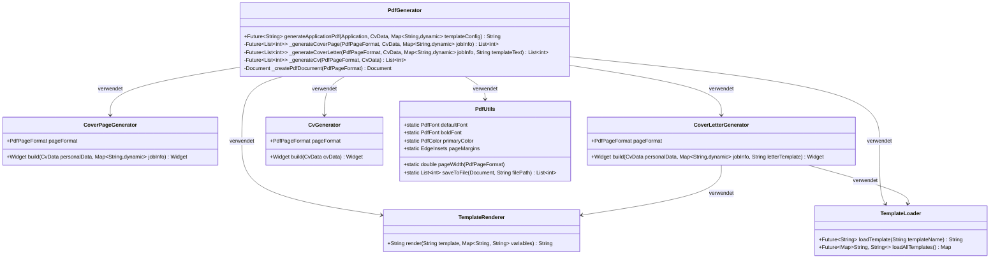
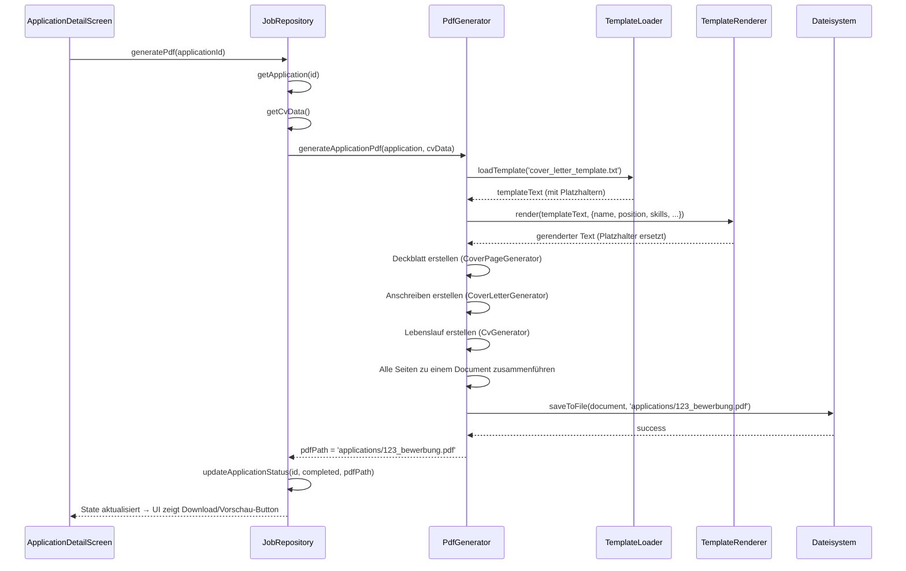

# PDF-Generierung

## Übersicht

Die PDF-Generierung erzeugt aus den vorhandenen Bewerbungsdaten (`CvData`) und den
Stellendaten (Job-Titel, Firma, URL) drei Dokumente pro Bewerbung:

1. **Deckblatt** – Enthält Absender, Firmenlogo-Platzhalter, Stellenbezeichnung, Datum
2. **Anschreiben** – Personalisierter Brief an die Firma (Anrede, Qualifikationen, Motivation)
3. **Lebenslauf** – Tabellarische/chronologische Darstellung der CV-Daten

Die generierten PDFs werden im Dateisystem gespeichert und der Pfad im `Application`-Modell
unter `pdfPath` hinterlegt.

---

## 1. Paketauswahl

Für Flutter/Dart gibt es mehrere PDF-Bibliotheken. Nach Analyse des Projekts
(Plattform-Unterstützung, Lizenz, Wartungszustand) empfiehlt sich:

| Paket | Version ( aktuell ) | Lizenz | Bewertung |
|-------|---------------------|--------|-----------|
| **[pdf](https://pub.dev/packages/pdf)** | 3.x | MIT | **Empfohlen** – Reines Dart, keine nativen Abhängigkeiten, volle Kontrolle über Layout, aktiv gewartet |
| [printing](https://pub.dev/packages/printing) | 5.x | MIT | Erweitert `pdf` um Druck/Vorschau, kann aber auch nur für Export genutzt werden |
| [dart_pdf](https://pub.dev/packages/dart_pdf) | – | – | Veraltet, nicht empfohlen |

**Entscheidung:** `pdf` (Core) + `printing` (optional für Vorschau/Druck).

```yaml
# pubspec.yaml – Neue Abhängigkeiten
dependencies:
  pdf: ^3.10.0
  printing: ^5.12.0
```

**Begründung:**
- `pdf` ist in reinem Dart geschrieben → läuft auf allen Plattformen (Windows, macOS, Linux, Android, iOS, Web)
- Keine nativen Build-Konfigurationen nötig
- `printing` bietet eine `PdfPreview`-Komponente für die Vorschau in der App
- Beide Pakete werden von der gleichen Community maintained und sind kompatibel

---

## 2. Architektur

Die PDF-Generierung wird als eigener Service im `data`-Layer implementiert,
angebunden über einen Riverpod-Provider.

### 2.1 Dateistruktur (neue/geänderte Dateien)

```
job_o_matic/lib/
├── core/
│   └── templates/
│       ├── template_loader.dart        # Lädt Vorlagen aus assets/mydata/vorlagen
│       └── template_renderer.dart      # Ersetzt Platzhalter in Textvorlagen
├── data/
│   ├── repositories/
│   │   └── job_repository.dart         # [GEÄNDERT] + generatePdf()-Methode
│   └── services/
│       ├── pdf/
│       │   ├── pdf_generator.dart      # Einstiegsklasse: orchestriert die Generierung
│       │   ├── cover_page_generator.dart   # Deckblatt-Erzeugung
│       │   ├── cover_letter_generator.dart # Anschreiben-Erzeugung
│       │   ├── cv_generator.dart           # Lebenslauf-Erzeugung
│       │   └── pdf_utils.dart              # Gemeinsame Helfer (Seitenränder, Fonts, Farben)
│       └── job_description_service.dart    # [NEU] Parst Stellenanzeigen (optional)
└── presentation/
    └── screens/
        └── application_detail_screen.dart # [GEÄNDERT] + PDF-Vorschau-Button
```

### 2.2 Klassendiagramm



### 2.3 Datenfluss



---

## 3. Detaillierte Implementierung

### 3.1 `PdfGenerator` (Einstiegsklasse)

```dart
class PdfGenerator {
  final TemplateLoader _templateLoader;
  final TemplateRenderer _templateRenderer;
  final CoverPageGenerator _coverPageGenerator;
  final CoverLetterGenerator _coverLetterGenerator;
  final CvGenerator _cvGenerator;

  PdfGenerator({
    required TemplateLoader templateLoader,
    required TemplateRenderer templateRenderer,
    required CoverPageGenerator coverPageGenerator,
    required CoverLetterGenerator coverLetterGenerator,
    required CvGenerator cvGenerator,
  }) : _templateLoader = templateLoader,
       _templateRenderer = templateRenderer,
       _coverPageGenerator = coverPageGenerator,
       _coverLetterGenerator = coverLetterGenerator,
       _cvGenerator = cvGenerator;

  /// Generiert eine vollständige Bewerbung als PDF und gibt den Dateipfad zurück.
  Future<String> generateApplicationPdf({
    required Application application,
    required CvData cvData,
    String? customTemplateName,
  }) async {
    final pageFormat = PdfPageFormat.a4;
    final pdfDocument = Document(pageFormat: pageFormat);

    // 1. Deckblatt
    final coverPage = _coverPageGenerator.build(
      personalData: cvData.personalData,
      jobInfo: {
        'jobTitle': application.jobTitle,
        'company': application.company,
        'date': DateFormat('dd.MM.yyyy').format(DateTime.now()),
      },
    );
    pdfDocument.addPage(coverPage);

    // 2. Anschreiben (mit Template)
    final templateText = await _templateLoader.loadTemplate(
      customTemplateName ?? 'cover_letter_default',
    );
    final renderedLetter = _templateRenderer.render(templateText, {
      'firstName': cvData.personalData.firstName,
      'lastName': cvData.personalData.lastName,
      'address': cvData.personalData.address ?? '',
      'jobTitle': application.jobTitle,
      'company': application.company,
      'date': DateFormat('dd.MM.yyyy').format(DateTime.now()),
      'skills': cvData.skills.map((s) => s.name).join(', '),
      'experience_years': _calculateTotalExperience(cvData.workExperience),
    });
    final letterPage = _coverLetterGenerator.build(
      personalData: cvData.personalData,
      renderedText: renderedLetter,
    );
    pdfDocument.addPage(letterPage);

    // 3. Lebenslauf
    final cvPage = _cvGenerator.build(cvData: cvData);
    pdfDocument.addPage(cvPage);

    // 4. Speichern
    final fileName =
        '${application.id}_${_sanitizeFileName(application.company)}.pdf';
    final directory = await _getApplicationDirectory();
    final filePath = '${directory.path}/$fileName';
    final bytes = await pdfDocument.save();

    final file = File(filePath);
    await file.writeAsBytes(bytes);

    return filePath;
  }

  String _sanitizeFileName(String name) {
    return name.replaceAll(RegExp(r'[^\w\s-]'), '').replaceAll(' ', '_');
  }

  String _calculateTotalExperience(List<WorkExperience> experiences) {
    // Berechnet die gesamte Berufserfahrung in Jahren
    int totalMonths = 0;
    for (final exp in experiences) {
      final start = exp.startDate;
      final end = exp.endDate ?? DateTime.now();
      totalMonths += (end.year - start.year) * 12 + (end.month - start.month);
    }
    return '${(totalMonths / 12).floor()} Jahre';
  }

  Future<Directory> _getApplicationDirectory() async {
    final appDir = await getApplicationDocumentsDirectory();
    final pdfDir = Directory('${appDir.path}/applications');
    if (!await pdfDir.exists()) {
      await pdfDir.create(recursive: true);
    }
    return pdfDir;
  }
}
```

### 3.2 `CoverPageGenerator` (Deckblatt)

```dart
class CoverPageGenerator {
  final PdfUtils _utils;

  CoverPageGenerator({required PdfUtils utils}) : _utils = utils;

  Widget build({
    required PersonalData personalData,
    required Map<String, dynamic> jobInfo,
  }) {
    return MultiPage(
      pageFormat: _utils.pageFormat,
      margin: _utils.pageMargins,
      build: (context) => [
        // Absender (oben links)
        Header(
          level: 0,
          child: Text(
            '${personalData.fullName}\n'
            '${personalData.address ?? ''}\n'
            '${personalData.email ?? ''}\n'
            '${personalData.phone ?? ''}',
            style: TextStyle(fontSize: 10, color: PdfColors.grey700),
          ),
        ),
        SizedBox(height: 80),

        // Firmenlogo-Platzhalter (zentriert)
        Center(
          child: Container(
            width: 120,
            height: 120,
            decoration: BoxDecoration(
              border: Border.all(color: PdfColors.grey300),
            ),
            child: Center(
              child: Text(
                'Logo',
                style: TextStyle(color: PdfColors.grey400),
              ),
            ),
          ),
        ),
        SizedBox(height: 60),

        // Stellenbezeichnung
        Center(
          child: Text(
            jobInfo['jobTitle'] as String,
            style: TextStyle(
              fontSize: 24,
              fontWeight: FontWeight.bold,
              color: _utils.primaryColor,
            ),
          ),
        ),
        SizedBox(height: 16),

        // Firmenname
        Center(
          child: Text(
            jobInfo['company'] as String,
            style: TextStyle(fontSize: 18, color: PdfColors.grey800),
          ),
        ),
        SizedBox(height: 40),

        // Datum
        Center(
          child: Text(
            'Datum: ${jobInfo['date']}',
            style: TextStyle(fontSize: 12, color: PdfColors.grey600),
          ),
        ),

        // Fußzeile
        ..._buildFooter(context, personalData),
      ],
    );
  }

  List<Widget> _buildFooter(Context context, PersonalData data) {
    return [
      SizedBox(height: 100),
      Divider(),
      Row(
        mainAxisAlignment: MainAxisAlignment.spaceBetween,
        children: [
          Text(data.email ?? '', style: TextStyle(fontSize: 8)),
          Text(data.phone ?? '', style: TextStyle(fontSize: 8)),
        ],
      ),
    ];
  }
}
```

### 3.3 `CoverLetterGenerator` (Anschreiben)

```dart
class CoverLetterGenerator {
  final PdfUtils _utils;

  CoverLetterGenerator({required PdfUtils utils}) : _utils = utils;

  Widget build({
    required PersonalData personalData,
    required String renderedText,
  }) {
    return MultiPage(
      pageFormat: _utils.pageFormat,
      margin: _utils.pageMargins,
      build: (context) => [
        // Absender (wie auf einem Brief)
        Text(
          '${personalData.fullName}\n'
          '${personalData.address ?? ''}\n'
          '${personalData.email ?? ''}\n'
          '${personalData.phone ?? ''}',
          style: TextStyle(fontSize: 9, color: PdfColors.grey600),
        ),
        SizedBox(height: 20),

        // Betreff
        Header(
          level: 1,
          child: Text(
            'Bewerbung als ${renderedText.split('\n').first}',
            style: TextStyle(
              fontSize: 14,
              fontWeight: FontWeight.bold,
            ),
          ),
        ),
        SizedBox(height: 12),

        // Anschreiben-Text (aus Template)
        Paragraph(
          text: renderedText,
          style: TextStyle(fontSize: 11, lineSpacing: 1.5),
        ),
        SizedBox(height: 20),

        // Grußformel
        Align(
          alignment: Alignment.centerRight,
          child: Text(
            'Mit freundlichen Grüßen\n${personalData.fullName}',
            style: TextStyle(fontSize: 11),
          ),
        ),
      ],
    );
  }
}
```

### 3.4 `CvGenerator` (Lebenslauf)

```dart
class CvGenerator {
  final PdfUtils _utils;

  CvGenerator({required PdfUtils utils}) : _utils = utils;

  Widget build({required CvData cvData}) {
    return MultiPage(
      pageFormat: _utils.pageFormat,
      margin: _utils.pageMargins,
      build: (context) => [
        // Überschrift
        Header(
          level: 0,
          child: Text(
            'Lebenslauf',
            style: TextStyle(
              fontSize: 22,
              fontWeight: FontWeight.bold,
              color: _utils.primaryColor,
            ),
          ),
        ),
        SizedBox(height: 8),

        // Persönliche Daten
        Header(
          level: 1,
          child: Text('Persönliche Daten',
              style: TextStyle(fontSize: 14, fontWeight: FontWeight.bold)),
        ),
        _buildInfoRow('Name', cvData.personalData.fullName),
        if (cvData.personalData.email != null)
          _buildInfoRow('E-Mail', cvData.personalData.email!),
        if (cvData.personalData.phone != null)
          _buildInfoRow('Telefon', cvData.personalData.phone!),
        SizedBox(height: 12),

        // Berufserfahrung
        if (cvData.workExperience.isNotEmpty) ...[
          Header(
            level: 1,
            child: Text('Berufserfahrung',
                style: TextStyle(fontSize: 14, fontWeight: FontWeight.bold)),
          ),
          ...cvData.workExperience.map(_buildExperienceEntry),
          SizedBox(height: 12),
        ],

        // Ausbildung
        if (cvData.education.isNotEmpty) ...[
          Header(
            level: 1,
            child: Text('Ausbildung',
                style: TextStyle(fontSize: 14, fontWeight: FontWeight.bold)),
          ),
          ...cvData.education.map(_buildEducationEntry),
          SizedBox(height: 12),
        ],

        // Kenntnisse
        if (cvData.skills.isNotEmpty) ...[
          Header(
            level: 1,
            child: Text('Kenntnisse',
                style: TextStyle(fontSize: 14, fontWeight: FontWeight.bold)),
          ),
          ...cvData.skills.map(_buildSkillEntry),
        ],
      ],
    );
  }

  Widget _buildInfoRow(String label, String value) {
    return Row(
      crossAxisAlignment: CrossAxisAlignment.start,
      children: [
        Container(
          width: 100,
          child: Text(label + ':',
              style: TextStyle(
                  fontWeight: FontWeight.bold,
                  fontSize: 10,
                  color: PdfColors.grey700)),
        ),
        Expanded(
          child: Text(value, style: TextStyle(fontSize: 10)),
        ),
      ],
    );
  }

  Widget _buildExperienceEntry(WorkExperience exp) {
    final dateStr = '${_formatDate(exp.startDate)} – '
        '${exp.isCurrent ? 'heute' : _formatDate(exp.endDate!)}';
    return Column(
      crossAxisAlignment: CrossAxisAlignment.start,
      children: [
        SizedBox(height: 6),
        Row(
          mainAxisAlignment: MainAxisAlignment.spaceBetween,
          children: [
            Text(exp.position,
                style:
                    TextStyle(fontSize: 11, fontWeight: FontWeight.bold)),
            Text(dateStr,
                style: TextStyle(fontSize: 9, color: PdfColors.grey600)),
          ],
        ),
        Text(exp.company,
            style: TextStyle(fontSize: 10, color: PdfColors.grey700)),
        if (exp.description != null)
          Padding(
            padding: const EdgeInsets.only(top: 4),
            child: Text(exp.description!,
                style: TextStyle(fontSize: 10)),
          ),
      ],
    );
  }

  // ... analog für _buildEducationEntry und _buildSkillEntry
}
```

### 3.5 `TemplateLoader` & `TemplateRenderer`

```dart
/// Lädt Textvorlagen aus dem assets-Verzeichnis.
class TemplateLoader {
  Future<String> loadTemplate(String templateName) async {
    try {
      return await rootBundle.loadString(
        'assets/mydata/vorlagen/$templateName.txt',
      );
    } catch (e) {
      // Fallback: Default-Vorlage aus dem Code
      return _defaultCoverLetterTemplate;
    }
  }
}

/// Ersetzt Platzhalter {{variable}} durch tatsächliche Werte.
class TemplateRenderer {
  String render(String template, Map<String, String> variables) {
    String result = template;
    variables.forEach((key, value) {
      result = result.replaceAll('{{$key}}', value);
    });
    return result;
  }
}
```

### 3.6 `PdfUtils` (gemeinsame Helfer)

```dart
class PdfUtils {
  static const pageMargins = EdgeInsets.all(48);
  static const primaryColor = PdfColors.red700; // entspricht AppTheme seed color
  static const defaultFontSize = 11.0;

  static PdfPageFormat get pageFormat =>
      PdfPageFormat.a4.copyWith(margin: pageMargins);
}
```

---

## 4. Integration in `JobRepository`

```dart
class JobRepository {
  // ... bestehende Felder

  final PdfGenerator _pdfGenerator;

  JobRepository({required PdfGenerator pdfGenerator})
      : _pdfGenerator = pdfGenerator;

  /// Generiert eine PDF für eine Bewerbung.
  Future<String> generatePdf(int applicationId) async {
    final app = _applications.firstWhere((a) => a.id == applicationId);
    final cvData = _cvData;

    if (cvData == null) {
      throw Exception('CV-Daten nicht geladen');
    }

    updateApplicationStatus(applicationId, ApplicationStatus.processing);

    try {
      final pdfPath = await _pdfGenerator.generateApplicationPdf(
        application: app,
        cvData: cvData,
      );
      updateApplicationStatus(
        applicationId,
        ApplicationStatus.completed,
        pdfPath: pdfPath,
      );
      return pdfPath;
    } catch (e) {
      updateApplicationStatus(
        applicationId,
        ApplicationStatus.failed,
        errorMessage: e.toString(),
      );
      rethrow;
    }
  }
}
```

### 4.1 Riverpod-Provider

```dart
final pdfUtilsProvider = Provider<PdfUtils>((ref) => PdfUtils());

final templateLoaderProvider = Provider<TemplateLoader>((ref) => TemplateLoader());

final templateRendererProvider = Provider<TemplateRenderer>((ref) => TemplateRenderer());

final coverPageGeneratorProvider = Provider<CoverPageGenerator>((ref) {
  return CoverPageGenerator(utils: ref.read(pdfUtilsProvider));
});

final coverLetterGeneratorProvider = Provider<CoverLetterGenerator>((ref) {
  return CoverLetterGenerator(utils: ref.read(pdfUtilsProvider));
});

final cvGeneratorProvider = Provider<CvGenerator>((ref) {
  return CvGenerator(utils: ref.read(pdfUtilsProvider));
});

final pdfGeneratorProvider = Provider<PdfGenerator>((ref) {
  return PdfGenerator(
    templateLoader: ref.read(templateLoaderProvider),
    templateRenderer: ref.read(templateRendererProvider),
    coverPageGenerator: ref.read(coverPageGeneratorProvider),
    coverLetterGenerator: ref.read(coverLetterGeneratorProvider),
    cvGenerator: ref.read(cvGeneratorProvider),
  );
});
```

---

## 5. UI-Integration

### 5.1 Vorschau-Button in `ApplicationDetailScreen`

```dart
// In ApplicationDetailScreen
if (application.pdfPath != null)
  ElevatedButton.icon(
    onPressed: () => _openPdfPreview(application.pdfPath!),
    icon: Icon(Icons.picture_as_pdf),
    label: Text('PDF anzeigen'),
  );

Future<void> _openPdfPreview(String pdfPath) async {
  final file = File(pdfPath);
  if (await file.exists()) {
    // Mit printing-Paket: openPdf(file: file, openForEditing: false);
    // Oder: Share.shareXFiles([XFile(pdfPath)], text: 'Bewerbung');
  }
}
```

### 5.2 Fortschrittsanzeige

```dart
// Während der Generierung
if (application.status == ApplicationStatus.processing)
  LinearProgressIndicator();
```

---

## 6. Vorlagen-Format (assets/mydata/vorlagen/)

Die Textvorlagen für das Anschreiben liegen als `.txt`-Dateien im Ordner
`assets/mydata/vorlagen/` und enthalten Platzhalter im Format `{{variable}}`.

### 6.1 Beispiel-Vorlage: `cover_letter_default.txt`

```
{{firstName}} {{lastName}}
{{address}}
{{email}}
{{phone}}

{{company}}
{{jobTitle}}

{{date}}

Betreff: Bewerbung als {{jobTitle}}

Sehr geehrte Damen und Herren,

mit großem Interesse habe ich Ihre Stellenausschreibung für die Position
als {{jobTitle}} bei der {{company}} gelesen.

Ich verfüge über {{experience_years}} Berufserfahrung und bringe fundierte
Kenntnisse in folgenden Bereichen mit: {{skills}}.

[... weitere Absätze ...]

Ich freue mich auf die Möglichkeit, mich in einem persönlichen Gespräch
vorstellen zu dürfen.

Mit freundlichen Grüßen
{{firstName}} {{lastName}}
```

### 6.2 Verfügbare Platzhalter

| Platzhalter | Quelle | Beschreibung |
|-------------|--------|-------------|
| `{{firstName}}`, `{{lastName}}` | `PersonalData` | Vor-/Nachname |
| `{{address}}` | `PersonalData` | Adresse |
| `{{email}}` | `PersonalData` | E-Mail |
| `{{phone}}` | `PersonalData` | Telefon |
| `{{jobTitle}}` | `Application` | Stellenbezeichnung |
| `{{company}}` | `Application` | Firmenname |
| `{{date}}` | aktuelles Datum | Generierungsdatum |
| `{{skills}}` | `CvData.skills` | Komma-getrennte Liste |
| `{{experience_years}}` | `CvData.workExperience` | Berufserfahrung in Jahren |

---

## 7. Fehlerbehandlung

| Fehler | Behandlung |
|--------|-----------|
| CV-Daten nicht geladen | Exception mit klarer Message → `ApplicationStatus.failed` |
| Vorlage nicht gefunden | Fallback auf eingebettete Default-Vorlage |
| Dateisystem nicht beschreibbar | Exception → User-Notification (Snackbar) |
| PDF-Generierung fehlgeschlagen | Exception loggen, Status auf `failed` setzen |
| Ungültige Zeichen im Dateinamen | `_sanitizeFileName()` entfernt problematische Zeichen |

---

## 8. Tests

### 8.1 Unit-Tests

| Test | Beschreibung |
|------|-------------|
| `PdfGenerator` erzeugt gültige PDF | Prüft, dass `save()` Bytes zurückgibt |
| `TemplateRenderer` ersetzt Platzhalter | `render('Hallo {{name}}', {'name': 'Test'})` → `'Hallo Test'` |
| `TemplateLoader` lädt Fallback bei fehlender Datei | Statt Exception → Default-Text |
| `CoverPageGenerator` erzeugt Widget-Struktur | Prüft, dass bestimmte Texte vorkommen |
| `CvGenerator` zeigt alle CV-Sektionen | Prüft Sektionstitel "Berufserfahrung", "Ausbildung", "Kenntnisse" |
| Dateiname wird korrekt gesanitized | `_sanitizeFileName('Firma & Co.')` → `'Firma__Co_'` |
| Berufserfahrung wird korrekt berechnet | `_calculateTotalExperience` mit bekannten Daten |

### 8.2 Integrationstests

| Test | Beschreibung |
|------|-------------|
| Vollständiger Generierungs-Workflow | URL → Application erstellen → PDF generieren → Datei existiert |
| PDF-Datei ist gültig | Datei-Header beginnt mit `%PDF` |

### 8.3 Widget-Tests

| Test | Beschreibung |
|------|-------------|
| Vorschau-Button erscheint bei `completed` | `ApplicationDetailScreen` zeigt Button nur bei fertiger PDF |
| Lade-Indikator bei `processing` | `LinearProgressIndicator` wird angezeigt |

---

## 9. Implementierungs-Reihenfolge

Die Umsetzung erfolgt in zwei Phasen: **Basis-Generierung** (Schritte 1–11) und
**Erweiterungen** (Schritte 12–18). Jeder Schritt baut auf den vorherigen auf.

### Phase A: Basis-Generierung (Must-Have)

1. **Abhängigkeiten** – `pdf` und `printing` zu `pubspec.yaml` hinzufügen
2. **`PdfUtils`** – Gemeinsame Helfer als Basis (Seitenränder, Farben, Schriftarten)
3. **`TemplateLoader` + `TemplateRenderer`** – Vorlagensystem für Anschreiben-Texte
4. **`CoverPageGenerator`** – Einfachster Generator (statisch, keine Datenabhängigkeit)
5. **`CvGenerator`** – Daten-getrieben, gut testbar (Lebenslauf aus CvData)
6. **`CoverLetterGenerator`** – Abhängig von Template-Rendering (personalisierter Brief)
7. **`PdfGenerator`** – Orchestrierung: Deckblatt + Anschreiben + Lebenslauf → PDF + Dateispeicherung
8. **Riverpod-Provider** – Dependency Injection für alle Generatoren
9. **`JobRepository.generatePdf()`** – Integration in den bestehenden State-Management-Flow
10. **UI** – Vorschau-Button in `ApplicationDetailScreen` + Fortschrittsanzeige bei `processing`
11. **Tests** – Unit-Tests, Integrationstests, Widget-Tests (siehe Abschnitt 8)

### Phase B: Erweiterungen

12. **PDF teilen** – `share_plus` (bereits in Dependencies) für `Share.shareXFiles([XFile(pdfPath)])` – ermöglicht Versand per E-Mail, WhatsApp etc.
13. **Drucken** – Native Druck-API über `printing`-Paket: `directPrintPdf(filePath)` – physischer Ausdruck direkt aus der App
14. **Template-Variablen erweitern** – Zusätzliche Platzhalter wie `{{company_address}}`, `{{contact_person}}`, `{{reference_number}}` in Vorlagen und Renderer aufnehmen
15. **Eigenes Layout** – YAML/JSON-Konfigurationsdatei für Seiten-Layout (Ränder, Farben, Schriftarten pro Dokumenttyp) – aus `assets/mydata/vorlagen/layout.yaml` laden
16. **Fotos im Lebenslauf** – Profilfoto aus `PersonalData.photoPath` in den `CvGenerator` einbinden
17. **Batch-Generierung** – Mehrere Bewerbungen parallel/sequentiell generieren: `JobRepository.generateAllPdfs()` mit Status-Tracking pro Application
18. **PDF-Verschlüsselung** – Passwortschutz für generierte PDFs via `pdf`-Paket (`Document(encryption: ...)`)
