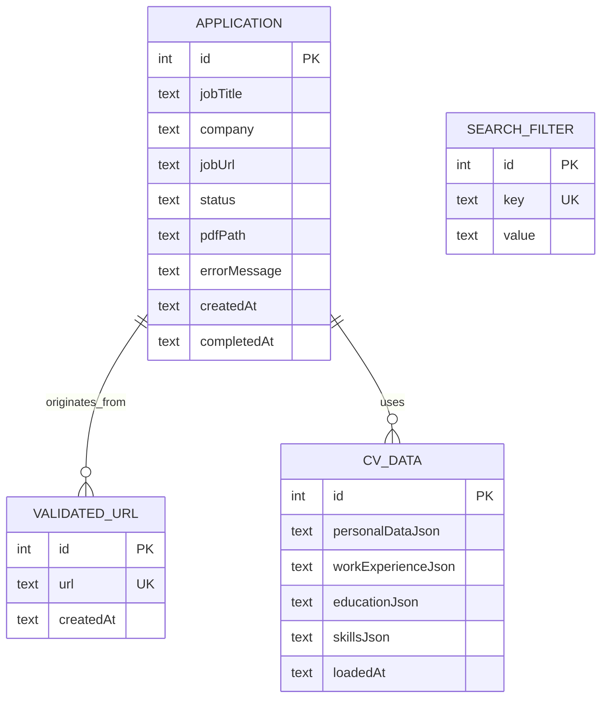

# Datenbank-Persistenz

## 1. Übersicht: Was muss persistent gespeichert werden?

Eine Analyse aller Plan-Dokumente (`0-Grundidee.md` bis `5-API-Anbindung.md`) und des bestehenden Quellcodes ergibt folgende **sechs Persistenzbereiche**:

| # | Bereich | Daten | Aktueller Status | Quelle |
|---|---------|-------|-----------------|--------|
| 1 | **Applications** | `Application`-Einträge mit Status, jobTitle, company, jobUrl, pdfPath, errorMessage, timestamps | In-Memory (`List<Application>`) | `1-AppBasis.md`, `job_repository.dart` |
| 2 | **Validierte URLs** | Liste von Stellen-URLs (Screen 1 → Screen 3) | In-Memory (`List<String>`) | `1-AppBasis.md` (Autosave alle 5s) |
| 3 | **CV-Daten** | `CvData` (PersonalData, WorkExperience, Education, Skill) | In-Memory (`CvData?`) | `0-Grundidee.md` |
| 4 | **Suchfilter & Einstellungen** | EmploymentType, WorkModel, targetCompanies, SalaryRange, letzte Sucheingaben, Jobcenter-Konfiguration | Nicht implementiert | `1-AppBasis.md` |
| 5 | **API-Keys** | BA-JOBBÖRSE-Key, Adzuna App-ID/Key, SerpAPI-Key, Brevo-API-Key | Nicht implementiert | `3-automailer.md`, `5-API-Anbindung.md` |
| 6 | **PDF-Dateien & Logs** | Generierte PDFs im App-Dokumentenverzeichnis, Log-Dateien im Cache | Nicht implementiert (nur Logging-Setup) | `4-PDF-Generierung.md`, `2-Workflow.md` |

---

## 2. Speicheroptionen: Vergleich

| Kriterium | **sqflite** (SQLite) | **SharedPreferences** | **Hive/Isar** | **Dateisystem** | **flutter_secure_storage** |
|-----------|----------------------|----------------------|---------------|-----------------|---------------------------|
| **Datenmodell** | Relational (Tabellen) | Key-Value | Key-Value / Objekt | Dateien/Ordner | Key-Value (verschlüsselt) |
| **Strukturierte Abfragen** | ✅ SQL (WHERE, JOIN, ORDER) | ❌ | ⚠️ Eingeschränkt | ❌ | ❌ |
| **Komplexe Objekte** | ✅ JSON-Spalte / normalisiert | ❌ (nur primitive Typen) | ✅ | ✅ (als JSON-Datei) | ❌ (nur Strings) |
| **Mengen >1000 Einträge** | ✅ | ❌ | ✅ | ⚠️ (langsam) | ❌ |
| **Verschlüsselung** | ✅ (SQLCipher) | ❌ | ✅ (Hive mit Locker) | ❌ (nativ) | ✅ |
| **Plattform** | Android, iOS, Desktop, Web (via `sqflite_common_ffi`) | Alle | Alle | Alle | Mobile + Desktop |
| **Performance** | ⭐⭐⭐ | ⭐⭐⭐⭐⭐ | ⭐⭐⭐⭐ | ⭐⭐ | ⭐⭐⭐ |
| **Zusätzliche Abhängigkeit** | ca. 200 KB | 0 KB (Teil von Flutter) | ca. 150 KB | 0 KB | ca. 100 KB |
| **Wartungszustand** | Aktiv (Google-empfohlen) | Stabil | Aktiv | Stabil | Aktiv (Flutter-Team) |

### Empfehlung: Kombinierter Ansatz

Für eine App dieser Größenordnung empfiehlt sich eine **Kombination** aus:

| Speicher | Verwendung | Begründung |
|----------|-----------|------------|
| **sqflite** (SQLite) | Applications, URLs, CV-Daten, Suchfilter | Strukturierte Daten mit Abfragen (z. B. "alle fehlgeschlagenen Bewerbungen", "Dubletten in 90 Tagen") |
| **flutter_secure_storage** | API-Keys (BA, Adzuna, Brevo) | Verschlüsselte Speicherung sensibler Schlüssel |
| **Dateisystem** | PDF-Dateien, Log-Dateien | Große Binärdateien gehören nicht in die Datenbank |
| **SharedPreferences** | App-Präferenzen (Theme, letzte Sitzung) | Einfache Schlüssel-Wert-Optionen |

---

## 3. Datenbank-Schema (sqflite)

### 3.1 Entity-Relationship-Diagramm



### 3.2 SQL-Tabellen-Definition

```sql
-- Tabelle 1: Bewerbungen (entspricht dem Application-Modell)
CREATE TABLE applications (
    id          INTEGER PRIMARY KEY AUTOINCREMENT,
    job_title   TEXT    NOT NULL DEFAULT 'Unbekannte Stelle',
    company     TEXT    NOT NULL DEFAULT 'Unbekanntes Unternehmen',
    job_url     TEXT    NOT NULL,
    status      TEXT    NOT NULL DEFAULT 'queued'
                        CHECK(status IN ('queued','processing','completed','failed','exported')),
    pdf_path    TEXT,
    error_message TEXT,
    created_at  TEXT    NOT NULL DEFAULT (datetime('now')),
    completed_at TEXT
);

-- Index für schnelle Status-Abfragen
CREATE INDEX idx_applications_status ON applications(status);
-- Index für Dublettenprüfung (gleiche URL in 90 Tagen)
CREATE INDEX idx_applications_job_url ON applications(job_url, created_at);

-- Tabelle 2: Validierte URLs (Autosave, Screen 1)
CREATE TABLE validated_urls (
    id          INTEGER PRIMARY KEY AUTOINCREMENT,
    url         TEXT    NOT NULL UNIQUE,
    created_at  TEXT    NOT NULL DEFAULT (datetime('now'))
);

-- Tabelle 3: Suchfilter & Einstellungen (Key-Value)
CREATE TABLE search_filters (
    id          INTEGER PRIMARY KEY AUTOINCREMENT,
    key         TEXT    NOT NULL UNIQUE,
    value       TEXT    NOT NULL
);

-- Standard-Einträge für Suchfilter:
-- ('last_query',         '{"text":"","location":"","radius":25}')
-- ('employment_type',    'both')
-- ('work_model',        'any')
-- ('target_companies',  '[]')
-- ('salary_min',        '')
-- ('salary_currency',   'EUR')
-- ('jobcenter_plz',     '')
-- ('favorite_companies','[]')

-- Tabelle 4: CV-Daten (JSON in Text-Spalte)
CREATE TABLE cv_data (
    id                  INTEGER PRIMARY KEY AUTOINCREMENT,
    personal_data_json  TEXT    NOT NULL,
    work_experience_json TEXT   NOT NULL DEFAULT '[]',
    education_json      TEXT    NOT NULL DEFAULT '[]',
    skills_json         TEXT    NOT NULL DEFAULT '[]',
    loaded_at           TEXT    NOT NULL DEFAULT (datetime('now'))
);
```

---

## 4. Datenbank-Service: Architektur & Implementierung

### 4.1 Neue Dateistruktur

```
job_o_matic/lib/
├── data/
│   ├── database/
│   │   ├── database_helper.dart     # Singleton: DB-Initialisierung, Migrationen
│   │   ├── tables.dart              # Tabellen-Namen, CREATE-Statements
│   │   └── converters.dart          # Application ↔ Map, CvData ↔ Map
│   ├── repositories/
│   │   ├── job_repository.dart      # [GEÄNDERT] Nutzt jetzt DatabaseHelper
│   │   └── database_repository.dart # [NEU] Direkter DB-Zugriff (für Testbarkeit)
│   └── services/
│       ├── api/
│       │   ├── api_client.dart      # [GEÄNDERT] + flutter_secure_storage
│       │   └── api_key_service.dart # [NEU] API-Key-Management
│       └── pdf/
│           └── pdf_generator.dart   # Unverändert
├── core/
│   └── logging/
│       └── app_logger.dart          # Unverändert (Datei-Logging bereits geplant)
```

### 4.2 `DatabaseHelper` – Zentrale Datenbankklasse

```dart
// lib/data/database/database_helper.dart
import 'package:sqflite/sqflite.dart';
import 'package:path/path.dart' as p;
import 'package:logging/logging.dart';

/// Singleton zur Verwaltung der SQLite-Datenbank.
///
/// Features:
/// - Lazy-Initialisierung (DB wird erst bei Bedarf geöffnet)
/// - Schema-Migration über Versionierung
/// - Zentrale Logging aller Datenbank-Operationen
class DatabaseHelper {
  static final Logger _log = Logger('DatabaseHelper');
  static DatabaseHelper? _instance;
  static Database? _database;

  DatabaseHelper._internal();

  /// Singleton-Instanz
  factory DatabaseHelper() {
    _instance ??= DatabaseHelper._internal();
    return _instance!;
  }

  /// Öffnet (oder erstellt) die Datenbank. Idempotent.
  Future<Database> get database async {
    _database ??= await _initDatabase();
    return _database!;
  }

  Future<Database> _initDatabase() async {
    final dbPath = await getDatabasesPath();
    final path = p.join(dbPath, 'job_o_matic.db');

    _log.info('Öffne Datenbank: $path');

    return openDatabase(
      path,
      version: 1,
      onCreate: _onCreate,
      onUpgrade: _onUpgrade,
      onConfigure: _onConfigure,
    );
  }

  /// Wird beim ersten Erstellen der DB aufgerufen.
  Future<void> _onCreate(Database db, int version) async {
    _log.info('Erstelle Datenbank-Schema (Version $version)');

    await db.execute('''
      CREATE TABLE applications (
        id            INTEGER PRIMARY KEY AUTOINCREMENT,
        job_title     TEXT    NOT NULL DEFAULT 'Unbekannte Stelle',
        company       TEXT    NOT NULL DEFAULT 'Unbekanntes Unternehmen',
        job_url       TEXT    NOT NULL,
        status        TEXT    NOT NULL DEFAULT 'queued'
                          CHECK(status IN ('queued','processing','completed','failed','exported')),
        pdf_path      TEXT,
        error_message TEXT,
        created_at    TEXT    NOT NULL DEFAULT (datetime('now')),
        completed_at  TEXT
      )
    ''');

    await db.execute('''
      CREATE INDEX idx_applications_status ON applications(status)
    ''');

    await db.execute('''
      CREATE INDEX idx_applications_job_url ON applications(job_url, created_at)
    ''');

    await db.execute('''
      CREATE TABLE validated_urls (
        id          INTEGER PRIMARY KEY AUTOINCREMENT,
        url         TEXT    NOT NULL UNIQUE,
        created_at  TEXT    NOT NULL DEFAULT (datetime('now'))
      )
    ''');

    await db.execute('''
      CREATE TABLE search_filters (
        id    INTEGER PRIMARY KEY AUTOINCREMENT,
        key   TEXT    NOT NULL UNIQUE,
        value TEXT    NOT NULL
      )
    ''');

    // Standard-Suchfilter initial einfügen
    await _insertDefaultFilters(db);

    await db.execute('''
      CREATE TABLE cv_data (
        id                  INTEGER PRIMARY KEY AUTOINCREMENT,
        personal_data_json  TEXT    NOT NULL,
        work_experience_json TEXT   NOT NULL DEFAULT '[]',
        education_json      TEXT    NOT NULL DEFAULT '[]',
        skills_json         TEXT    NOT NULL DEFAULT '[]',
        loaded_at           TEXT    NOT NULL DEFAULT (datetime('now'))
      )
    ''');

    _log.info('Datenbank-Schema erfolgreich erstellt');
  }

  Future<void> _onUpgrade(Database db, int oldVersion, int newVersion) async {
    _log.info('Migriere Datenbank: $oldVersion → $newVersion');
    // Zukünftige Migrationen hier einfügen:
    // if (oldVersion < 2) { ... }

    // Hinweis: In Produktion keine DROP-TABLE-Migrationen verwenden,
    // sondern ALTER TABLE + Daten-Konvertierung.
  }

  Future<void> _onConfigure(Database db) async {
    // Performance-Optimierungen
    await db.execute('PRAGMA journal_mode=WAL');     // Write-Ahead-Logging
    await db.execute('PRAGMA foreign_keys=ON');       // Fremdschlüssel aktivieren
  }

  Future<void> _insertDefaultFilters(Database db) async {
    final defaults = {
      'last_query': '{"text":"","location":"","radius":25}',
      'employment_type': 'both',
      'work_model': 'any',
      'target_companies': '[]',
      'salary_min': '',
      'salary_currency': 'EUR',
      'jobcenter_plz': '',
      'favorite_companies': '[]',
    };

    final batch = db.batch();
    for (final entry in defaults.entries) {
      batch.insert('search_filters', {
        'key': entry.key,
        'value': entry.value,
      });
    }
    await batch.commit(noResult: true);
  }

  /// Schließt die Datenbank (z. B. beim App-Beenden).
  Future<void> close() async {
    final db = _database;
    if (db != null && db.isOpen) {
      await db.close();
      _database = null;
      _log.info('Datenbank geschlossen');
    }
  }

  /// Setzt die Datenbank zurück (für Tests).
  Future<void> reset() async {
    await close();
    final dbPath = await getDatabasesPath();
    final path = p.join(dbPath, 'job_o_matic.db');
    await deleteDatabase(path);
    _log.info('Datenbank zurückgesetzt');
  }
}
```

### 4.3 `DatabaseRepository` – CRUD-Operationen

```dart
// lib/data/repositories/database_repository.dart
import 'package:sqflite/sqflite.dart';
import 'package:logging/logging.dart';
import '../database/database_helper.dart';
import '../../models/application.dart';
import '../../models/cv_data.dart';

/// Repository für direkte Datenbank-Zugriffe.
///
/// Kapselt alle SQL-Operationen und stellt typsichere Methoden
/// für die Geschäftslogik bereit.
class DatabaseRepository {
  final Logger _log = Logger('DatabaseRepository');
  final DatabaseHelper _dbHelper;

  DatabaseRepository({DatabaseHelper? dbHelper})
      : _dbHelper = dbHelper ?? DatabaseHelper();

  // ---------------------------------------------------------------------------
  // APPLICATIONS
  // ---------------------------------------------------------------------------

  /// Alle Bewerbungen laden (sortiert nach created_at DESC).
  Future<List<Application>> loadApplications() async {
    final db = await _dbHelper.database;
    final rows = await db.query(
      'applications',
      orderBy: 'created_at DESC',
    );
    return rows.map(_rowToApplication).toList();
  }

  /// Einzelne Bewerbung per ID laden.
  Future<Application?> loadApplication(int id) async {
    final db = await _dbHelper.database;
    final rows = await db.query(
      'applications',
      where: 'id = ?',
      whereArgs: [id],
      limit: 1,
    );
    if (rows.isEmpty) return null;
    return _rowToApplication(rows.first);
  }

  /// Neue Bewerbung einfügen.
  Future<int> insertApplication(Application app) async {
    final db = await _dbHelper.database;
    final id = await db.insert('applications', _applicationToRow(app));
    _log.info('Application eingefügt: ID=$id, ${app.jobTitle}');
    return id;
  }

  /// Bewerbung aktualisieren (Status, pdfPath, errorMessage).
  Future<void> updateApplication(Application app) async {
    final db = await _dbHelper.database;
    await db.update(
      'applications',
      _applicationToRow(app),
      where: 'id = ?',
      whereArgs: [app.id],
    );
    _log.fine('Application $id aktualisiert: Status=${app.status.name}');
  }

  /// Bewerbung löschen.
  Future<void> deleteApplication(int id) async {
    final db = await _dbHelper.database;
    await db.delete('applications', where: 'id = ?', whereArgs: [id]);
    _log.info('Application $id gelöscht');
  }

  /// Prüfen, ob eine URL bereits in den letzten 90 Tagen verarbeitet wurde.
  Future<bool> isDuplicateUrl(String url) async {
    final db = await _dbHelper.database;
    final ninetyDaysAgo = DateTime.now()
        .subtract(const Duration(days: 90))
        .toIso8601String();

    final result = await db.query(
      'applications',
      where: 'job_url = ? AND created_at >= ?',
      whereArgs: [url, ninetyDaysAgo],
      limit: 1,
    );
    return result.isNotEmpty;
  }

  /// Alle Bewerbungen mit bestimmtem Status.
  Future<List<Application>> loadApplicationsByStatus(
      ApplicationStatus status) async {
    final db = await _dbHelper.database;
    final rows = await db.query(
      'applications',
      where: 'status = ?',
      whereArgs: [status.name],
      orderBy: 'created_at DESC',
    );
    return rows.map(_rowToApplication).toList();
  }

  // ---------------------------------------------------------------------------
  // VALIDATED URLS
  // ---------------------------------------------------------------------------

  /// Alle validierten URLs laden.
  Future<List<String>> loadValidatedUrls() async {
    final db = await _dbHelper.database;
    final rows = await db.query('validated_urls', orderBy: 'created_at DESC');
    return rows.map((r) => r['url'] as String).toList();
  }

  /// Validierte URLs speichern (zuvor alle löschen → ersetzen).
  Future<void> saveValidatedUrls(List<String> urls) async {
    final db = await _dbHelper.database;
    await db.transaction((txn) async {
      await txn.delete('validated_urls');
      final batch = txn.batch();
      for (final url in urls) {
        batch.insert('validated_urls', {
          'url': url,
          'created_at': DateTime.now().toIso8601String(),
        });
      }
      await batch.commit(noResult: true);
    });
    _log.info('Validierte URLs gespeichert: ${urls.length}');
  }

  // ---------------------------------------------------------------------------
  // SEARCH FILTERS
  // ---------------------------------------------------------------------------

  /// Einzelnen Suchfilter laden.
  Future<String?> loadFilter(String key) async {
    final db = await _dbHelper.database;
    final rows = await db.query(
      'search_filters',
      where: 'key = ?',
      whereArgs: [key],
      limit: 1,
    );
    if (rows.isEmpty) return null;
    return rows.first['value'] as String;
  }

  /// Alle Suchfilter laden.
  Future<Map<String, String>> loadAllFilters() async {
    final db = await _dbHelper.database;
    final rows = await db.query('search_filters');
    return {for (final r in rows) r['key'] as String: r['value'] as String};
  }

  /// Suchfilter speichern (upsert).
  Future<void> saveFilter(String key, String value) async {
    final db = await _dbHelper.database;
    await db.insert(
      'search_filters',
      {'key': key, 'value': value},
      conflictAlgorithm: ConflictAlgorithm.replace,
    );
  }

  /// Mehrere Filter auf einmal speichern.
  Future<void> saveFilters(Map<String, String> filters) async {
    final db = await _dbHelper.database;
    final batch = db.batch();
    for (final entry in filters.entries) {
      batch.insert(
        'search_filters',
        {'key': entry.key, 'value': entry.value},
        conflictAlgorithm: ConflictAlgorithm.replace,
      );
    }
    await batch.commit(noResult: true);
  }

  // ---------------------------------------------------------------------------
  // CV DATA
  // ---------------------------------------------------------------------------

  /// Aktuelle CV-Daten laden (neuesten Eintrag).
  Future<CvData?> loadCvData() async {
    final db = await _dbHelper.database;
    final rows = await db.query(
      'cv_data',
      orderBy: 'id DESC',
      limit: 1,
    );
    if (rows.isEmpty) return null;
    return _rowToCvData(rows.first);
  }

  /// CV-Daten speichern (alten Eintrag ersetzen).
  Future<void> saveCvData(CvData cvData) async {
    final db = await _dbHelper.database;
    await db.transaction((txn) async {
      await txn.delete('cv_data'); // nur neuesten Satz behalten
      await txn.insert('cv_data', _cvDataToRow(cvData));
    });
    _log.info('CV-Daten gespeichert für: ${cvData.personalData.fullName}');
  }

  // ---------------------------------------------------------------------------
  // KONVERTER (privat)
  // ---------------------------------------------------------------------------

  Map<String, dynamic> _applicationToRow(Application app) => {
        'id': app.id,
        'job_title': app.jobTitle,
        'company': app.company,
        'job_url': app.jobUrl,
        'status': app.status.name,
        'pdf_path': app.pdfPath,
        'error_message': app.errorMessage,
        'created_at': app.createdAt.toIso8601String(),
        'completed_at': app.completedAt?.toIso8601String(),
      };

  Application _rowToApplication(Map<String, dynamic> row) => Application(
        id: row['id'] as int,
        jobTitle: row['job_title'] as String,
        company: row['company'] as String,
        jobUrl: row['job_url'] as String,
        status: ApplicationStatus.values.firstWhere(
          (e) => e.name == row['status'],
          orElse: () => ApplicationStatus.queued,
        ),
        pdfPath: row['pdf_path'] as String?,
        errorMessage: row['error_message'] as String?,
        createdAt: DateTime.parse(row['created_at'] as String),
        completedAt: row['completed_at'] != null
            ? DateTime.parse(row['completed_at'] as String)
            : null,
      );

  Map<String, dynamic> _cvDataToRow(CvData cvData) => {
        'personal_data_json': cvData.personalData.toJson().toString(),
        'work_experience_json':
            cvData.workExperience.map((e) => e.toJson()).toList().toString(),
        'education_json':
            cvData.education.map((e) => e.toJson()).toList().toString(),
        'skills_json': cvData.skills.map((e) => e.toJson()).toList().toString(),
        'loaded_at': DateTime.now().toIso8601String(),
      };

  CvData _rowToCvData(Map<String, dynamic> row) {
    // Hinweis: JSON-Parsing muss korrekt implementiert werden.
    // Die toString()-Aufrufe oben sind Platzhalter – in der Praxis
    // sollte `dart:convert` jsonEncode/jsonDecode verwendet werden.
    return CvData(
      personalData: PersonalData.fromJson(
          const { /* aus row['personal_data_json'] parsen */ }),
      // ... analog für workExperience, education, skills
    );
  }
}
```

---

## 5. Migration: `JobRepository` von In-Memory auf Datenbank

### 5.1 Aktuelle Situation (Ist-Zustand)

Der `JobRepository` (`lib/data/repositories/job_repository.dart`) hält alle Daten **in-Memory**:

```dart
final List<String> _validatedUrls = [];
final List<Application> _applications = [];
CvData? _cvData;
```

Probleme:
- Daten gehen beim App-Neustart verloren
- Keine Dublettenprüfung über Sitzungsgrenzen hinweg
- Suche-Filter-Einstellungen nicht persistent
- Keine Transaktionssicherheit

### 5.2 Ziel-Architektur (Soll-Zustand)

```mermaid
flowchart LR
    subgraph "UI Layer"
        Screen1[Stelleneingabe]
        Screen2[Jobsuche]
        Screen3[Ergebnisübersicht]
    end

    subgraph "Data Layer"
        Repo[JobRepository\n(In-Memory Cache)]
        DB[DatabaseRepository\n(SQLite)]
        Secure[ApiKeyService\n(Secure Storage)]
    end

    subgraph "Storage"
        SQL[(SQLite\njob_o_matic.db)]
        FS[(Dateisystem\nPDFs, Logs)]
        SS[(Secure Storage\nAPI Keys)]
    end

    Screen1 -->|"Autosave (5s)"| Repo
    Screen2 -->|"Filter speichern"| Repo
    Screen3 -->|"Status-Updates"| Repo

    Repo -->|"loadApplications()"| DB
    Repo -->|"saveValidatedUrls()"| DB
    Repo -->|"saveFilter()"| DB
    DB --> SQL

    Secure --> SS

    Repo -.->|"PDF-Referenz"| FS
```

### 5.3 Überarbeiteter `JobRepository` (Auszug)

```dart
// lib/data/repositories/job_repository.dart (überarbeitet)
class JobRepository {
  final Logger _log = Logger('JobRepository');
  final DatabaseRepository _dbRepo;

  // In-Memory-Cache (synchron für UI-Performance)
  List<Application> _applications = [];
  List<String> _validatedUrls = [];
  CvData? _cvData;
  Map<String, String> _searchFilters = {};

  JobRepository({DatabaseRepository? dbRepo})
      : _dbRepo = dbRepo ?? DatabaseRepository();

  // ---------------------------------------------------------------------------
  // INITIALISIERUNG
  // ---------------------------------------------------------------------------

  /// Lädt alle persistierten Daten beim App-Start.
  Future<void> initialize() async {
    _log.info('Initialisiere JobRepository aus Datenbank...');

    final results = await Future.wait([
      _dbRepo.loadApplications(),
      _dbRepo.loadValidatedUrls(),
      _dbRepo.loadCvData(),
      _dbRepo.loadAllFilters(),
    ]);

    _applications = results[0] as List<Application>;
    _validatedUrls = results[1] as List<String>;
    _cvData = results[2] as CvData?;
    _searchFilters = results[3] as Map<String, String>;

    _log.info('JobRepository initialisiert: '
        '${_applications.length} Applications, '
        '${_validatedUrls.length} URLs, '
        '${_cvData != null ? 'CV-Daten vorhanden' : 'keine CV-Daten'}');
  }

  // ---------------------------------------------------------------------------
  // APPLICATION MANAGEMENT (mit Persistenz)
  // ---------------------------------------------------------------------------

  @override
  Future<List<Application>> createApplicationsFromUrls() async {
    final newApps = <Application>[];
    for (final url in _validatedUrls) {
      // Dublettenprüfung über 90 Tage
      if (await _dbRepo.isDuplicateUrl(url)) {
        _log.info('Überspringe Dublette: $url');
        continue;
      }

      final app = Application(
        id: 0, // wird von der DB vergeben
        jobTitle: 'Unbekannte Stelle',
        company: 'Unbekanntes Unternehmen',
        jobUrl: url,
        createdAt: DateTime.now(),
      );

      final id = await _dbRepo.insertApplication(app);
      final savedApp = app.copyWith(id: id);
      _applications.add(savedApp);
      newApps.add(savedApp);
    }

    // Validierte URLs nach Übernahme leeren
    _validatedUrls.clear();
    await _dbRepo.saveValidatedUrls([]);

    _log.info('Applikationen erstellt: ${newApps.length}');
    return newApps;
  }

  @override
  Future<void> updateApplicationStatus(int id, ApplicationStatus status,
      {String? pdfPath, String? errorMessage}) async {
    final index = _applications.indexWhere((a) => a.id == id);
    if (index >= 0) {
      final updated = _applications[index].copyWith(
        status: status,
        pdfPath: pdfPath,
        errorMessage: errorMessage,
        completedAt:
            status == ApplicationStatus.completed ? DateTime.now() : null,
      );
      _applications[index] = updated;
      await _dbRepo.updateApplication(updated);
      _log.info('Applikation $id: Status -> ${status.displayName}');
    }
  }

  @override
  Future<void> removeApplication(int id) async {
    _applications.removeWhere((a) => a.id == id);
    await _dbRepo.deleteApplication(id);
    _log.info('Applikation $id entfernt');
  }

  // ---------------------------------------------------------------------------
  // URL-MANAGEMENT (mit Autosave)
  // ---------------------------------------------------------------------------

  @override
  Future<void> addValidatedUrls(List<String> urls) async {
    final before = _validatedUrls.length;
    for (final url in urls) {
      final normalizedUrl = _normalizeUrl(url);
      if (!_validatedUrls.contains(normalizedUrl)) {
        _validatedUrls.add(normalizedUrl);
      }
    }
    final added = _validatedUrls.length - before;
    _log.info('URLs hinzugefügt: $added (neu) / ${urls.length} (eingegeben)');

    // Autosave: persistiere sofort
    await _dbRepo.saveValidatedUrls(_validatedUrls);
  }

  // ---------------------------------------------------------------------------
  // SUCHFILTER (Persistenz)
  // ---------------------------------------------------------------------------

  @override
  Future<void> saveFilter(String key, String value) async {
    _searchFilters[key] = value;
    await _dbRepo.saveFilter(key, value);
  }

  @override
  String? getFilter(String key) => _searchFilters[key];

  @override
  Future<void> saveAllFilters(Map<String, String> filters) async {
    _searchFilters.addAll(filters);
    await _dbRepo.saveFilters(filters);
  }

  // ---------------------------------------------------------------------------
  // CV-DATEN (Persistenz)
  // ---------------------------------------------------------------------------

  @override
  Future<void> setCvData(CvData data) async {
    _cvData = data;
    await _dbRepo.saveCvData(data);
    _log.info('CV-Daten gespeichert für: ${data.personalData.fullName}');
  }
}
```

### 5.4 Riverpod-Provider (aktualisiert)

```dart
// lib/data/repositories/job_repository.dart (Provider)
final databaseHelperProvider = Provider<DatabaseHelper>((ref) {
  return DatabaseHelper();
});

final databaseRepositoryProvider = Provider<DatabaseRepository>((ref) {
  return DatabaseRepository(dbHelper: ref.read(databaseHelperProvider));
});

final jobRepositoryProvider = FutureProvider<JobRepository>((ref) async {
  final repo = JobRepository(dbRepo: ref.read(databaseRepositoryProvider));
  await repo.initialize();
  return repo;
});
```

**Wichtige Änderung:** Der Provider wird von `Provider` zu `FutureProvider` geändert, da die Initialisierung async ist. Alle Widgets, die `ref.watch(jobRepositoryProvider)` verwenden, müssen jetzt mit `AsyncValue` umgehen können (`when(data: ..., loading: ..., error: ...)`).

Um diese Umstellung zu vermeiden, kann alternativ ein **synchroner Initialisierungs-Call in `main.dart`** erfolgen:

```dart
// lib/main.dart (Alternative: synchrone Initialisierung vor runApp)
void main() async {
  WidgetsFlutterBinding.ensureInitialized();

  AppLogger.init(level: Level.ALL, enableFileLogging: false);

  // Datenbank vor App-Start initialisieren (blockiert kurz)
  final dbHelper = DatabaseHelper();
  await dbHelper.database;

  runApp(
    const ProviderScope(
      child: JobOMaticApp(),
    ),
  );
}
```

Dann kann `jobRepositoryProvider` ein normaler `Provider` bleiben (da die DB beim ersten Zugriff bereits bereit ist).

---

## 6. API-Key-Management (`flutter_secure_storage`)

### 6.1 `ApiKeyService`

```dart
// lib/data/services/api/api_key_service.dart
import 'package:flutter_secure_storage/flutter_secure_storage.dart';
import 'package:logging/logging.dart';

/// Verwaltet API-Keys sicher und plattformübergreifend.
///
/// Nutzt flutter_secure_storage für verschlüsselte Ablage:
/// - Android: EncryptedSharedPreferences
/// - iOS: Keychain Services
/// - Desktop: Verzeichnis mit Dateisystem-Berechtigungen
class ApiKeyService {
  final Logger _log = Logger('ApiKeyService');
  final FlutterSecureStorage _storage;

  static const _prefix = 'api_key_';

  /// Definierte API-Key-Namen
  static const String baApiKey = 'ba_jobboerse';
  static const String adzunaAppId = 'adzuna_app_id';
  static const String adzunaApiKey = 'adzuna_api_key';
  static const String serpApiKey = 'serpapi';
  static const String brevoApiKey = 'brevo';

  ApiKeyService({FlutterSecureStorage? storage})
      : _storage = storage ?? const FlutterSecureStorage();

  /// API-Key speichern.
  Future<void> saveKey(String name, String key) async {
    await _storage.write(key: '$_prefix$name', value: key);
    _log.info('API-Key "$name" gespeichert');
  }

  /// API-Key laden.
  Future<String?> loadKey(String name) async {
    return _storage.read(key: '$_prefix$name');
  }

  /// API-Key löschen.
  Future<void> deleteKey(String name) async {
    await _storage.delete(key: '$_prefix$name');
    _log.info('API-Key "$name" gelöscht');
  }

  /// Prüfen, ob ein Key existiert.
  Future<bool> hasKey(String name) async {
    final key = await loadKey(name);
    return key != null && key.isNotEmpty;
  }

  /// Alle gespeicherten Keys abrufen (für Konfigurationsscreen).
  Future<Map<String, bool>> getKeyStatus() async {
    final keys = [baApiKey, adzunaAppId, adzunaApiKey, serpApiKey, brevoApiKey];
    final result = <String, bool>{};
    for (final name in keys) {
      result[name] = await hasKey(name);
    }
    return result;
  }
}
```

### 6.2 Erweiterung des `ApiClient`

```dart
// lib/data/services/api/api_client.dart (Auszug – Erweiterung)
class ApiClient {
  // ... bestehende Felder

  final ApiKeyService _keyService;

  ApiClient({
    required Logger logger,
    required ApiKeyService keyService,
    // ...
  }) : _keyService = keyService;

  Future<http.Response> get(
    Uri uri, {
    String? apiKeyName,
    // ...
  }) async {
    final headers = <String, String>{
      'User-Agent': 'Job-O-Matic/1.0',
    };

    // API-Key automatisch aus Secure Storage laden
    if (apiKeyName != null) {
      final key = await _keyService.loadKey(apiKeyName);
      if (key != null) {
        headers['X-API-Key'] = key;
      }
    }

    // ... Rest der Methode
  }
}
```

---

## 7. Autosave-Mechanismus für URL-Eingabe

In `1-AppBasis.md` wird ein **Autosave alle 5 Sekunden** für die URL-Eingabe gefordert.

### 7.1 Debounced Autosave (Klasse)

```dart
// lib/data/services/autosave_service.dart
import 'dart:async';
import 'package:logging/logging.dart';

/// Führt regelmäßige Speichervorgänge mit Debounding durch.
///
/// Speichert nach der letzten Änderung nach einer konfigurierbaren
/// Verzögerung (Standard: 5 Sekunden).
class AutosaveService {
  final Logger _log = Logger('AutosaveService');
  final Duration _delay;
  Timer? _timer;
  Future<void> Function()? _saveCallback;

  AutosaveService({Duration? delay}) : _delay = delay ?? const Duration(seconds: 5);

  /// Startet die Überwachung. Ruft [onSave] nach Verzögerung auf.
  void start(Future<void> Function() onSave) {
    _saveCallback = onSave;
    _log.fine('Autosave gestartet (Intervall: ${_delay.inSeconds}s)');
  }

  /// Wird bei jeder Änderung aufgerufen. Setzt den Timer zurück.
  void notifyChange() {
    _timer?.cancel();
    _timer = Timer(_delay, _doSave);
  }

  Future<void> _doSave() async {
    if (_saveCallback != null) {
      try {
        await _saveCallback!();
        _log.fine('Autosave erfolgreich');
      } catch (e) {
        _log.warning('Autosave fehlgeschlagen: $e');
      }
    }
  }

  /// Sofort speichern (z. B. beim Verlassen des Screens).
  Future<void> saveImmediately() async {
    _timer?.cancel();
    await _doSave();
  }

  /// Stoppt den Timer.
  void dispose() {
    _timer?.cancel();
    _saveCallback = null;
  }
}
```

### 7.2 Integration in `JobInputScreen`

```dart
// lib/presentation/screens/job_input_screen.dart (Auszug)
class JobInputScreenState extends State<JobInputScreen> {
  final TextEditingController _urlController = TextEditingController();
  late final AutosaveService _autosave;

  @override
  void initState() {
    super.initState();
    _autosave = AutosaveService();

    // Gespeicherte URLs aus DB laden
    _loadSavedUrls();

    // Autosave starten
    _autosave.start(() async {
      final repo = context.read(jobRepositoryProvider);
      final urls = _urlController.text
          .split('\n')
          .map((u) => u.trim())
          .where((u) => u.isNotEmpty)
          .toList();
      await repo.addValidatedUrls(urls);
    });
  }

  void _onTextChanged(String text) {
    _autosave.notifyChange(); // Timer alle 5s zurücksetzen
  }

  @override
  void dispose() {
    _autosave.dispose();
    _urlController.dispose();
    super.dispose();
  }
}
```

---

## 8. Fehlerbehandlung & Edge Cases

| Szenario | Behandlung |
|----------|-----------|
| **Datenbank kann nicht geöffnet werden** (z. B. beschädigte DB) | DB zurücksetzen (`deleteDatabase`), neu erstellen, vorherige Daten sind verloren → Log-Eintrag auf `severe` + Snackbar "Datenbank wurde zurückgesetzt" |
| **Migration fehlschlägt** (Schema-Änderung inkompatibel) | `onUpgrade` fängt Exception → Fallback auf `onCreate` (Datenverlust in Kauf nehmen) + Log + Benachrichtigung |
| **Gleichzeitiger Zugriff** (zwei Isolate) | SQLite unterstützt `WAL-Mode` + `BEGIN IMMEDIATE` für konfliktfreie Lesevorgänge. Schreibzugriffe werden serialisiert. |
| **Festplatte voll** (PDF-Speicherung) | `File.writeAsBytes` wirft `FileSystemException` → wird im `PdfGenerator` gefangen → `ApplicationStatus.failed` + Fehlermeldung |
| **Secure Storage nicht verfügbar** (z. B. Web) | Fallback auf In-Memory-Storage mit Warnhinweis "API-Keys werden nicht dauerhaft gespeichert" |
| **Autosave während App-Beendigung** | `WidgetsBindingObserver` in `JobInputScreen`: Bei `didChangeAppLifecycleState(AppLifecycleState.paused)` → `_autosave.saveImmediately()` |
| **Dublette über 90 Tage hinaus** | `isDuplicateUrl()` prüft nur innerhalb 90 Tage. Ältere Einträge werden nicht als Dublette gewertet (Neuberechnung möglich). |
| **Leerer Suchfilter** | Alle Filter haben Default-Werte aus `_insertDefaultFilters()`. Kein `null` möglich. |
| **CV-Daten zu groß** (> 1 MB JSON) | SQLite kann problemlos mehrere MB in TEXT-Spalten speichern. Bei > 5 MB: Warnung im Log + Kompression mit `gzip` vor dem Speichern. |
| **DB-Version-Konflikt nach Downgrade** (ältere App-Version) | `onUpgrade` wird nur bei Upgrade aufgerufen. Bei Downgrade bleibt die alte DB erhalten – die neue App-Version muss abwärtskompatibel sein (nur ADD COLUMN, nie DROP). |

---

## 9. Abhängigkeiten (pubspec.yaml – Erweiterung)

```yaml
dependencies:
  # Bestehend:
  flutter:
    sdk: flutter
  go_router: ^14.0.0
  flutter_riverpod: ^2.5.0
  riverpod_annotation: ^2.3.0
  logging: ^1.2.0
  path_provider: ^2.1.0
  intl: ^0.19.0
  http: ^1.2.0
  share_plus: ^9.0.0
  path: ^1.9.0

  # Neu für Datenbank-Persistenz:
  sqflite: ^2.3.0                        # SQLite-Datenbank
  sqflite_common_ffi: ^2.3.0             # Desktop-Unterstützung (Windows/Linux/macOS)
  flutter_secure_storage: ^9.0.0         # Verschlüsselte API-Key-Speicherung

dev_dependencies:
  flutter_test:
    sdk: flutter
  flutter_lints: ^6.0.0
  build_runner: ^2.4.0
  riverpod_generator: ^2.4.0

  # Neu für Tests:
  sqflite_common_ffi_web: ^0.4.0         # Web-Unterstützung für Tests
  mockito: ^5.4.0                        # Mocking für Unit-Tests
```

### Plattform-spezifische Konfiguration

Für **Desktop-Unterstützung** (Windows, Linux, macOS) muss `sqflite_common_ffi` in `main.dart` initialisiert werden:

```dart
// lib/main.dart (Desktop-Erweiterung)
import 'package:sqflite_common_ffi/sqflite_ffi.dart';

void main() async {
  // Datenbank-Factory für Desktop initialisieren
  if (isDesktop) {
    sqfliteFfiInit();
    databaseFactory = databaseFactoryFfi;
  }

  // ... Rest der main()
}

bool get isDesktop {
  return [
    TargetPlatform.windows,
    TargetPlatform.linux,
    TargetPlatform.macOS,
  ].contains(defaultTargetPlatform);
}
```

---

## 10. Tests

### 10.1 Unit-Tests (DatabaseRepository)

```dart
// test/data/repositories/database_repository_test.dart
import 'package:flutter_test/flutter_test.dart';
import 'package:sqflite_common_ffi/sqflite_ffi.dart';
import 'package:job_o_matic/data/database/database_helper.dart';
import 'package:job_o_matic/data/repositories/database_repository.dart';
import 'package:job_o_matic/models/application.dart';

void main() {
  late DatabaseHelper dbHelper;
  late DatabaseRepository dbRepo;

  setUp(() async {
    sqfliteFfiInit();
    databaseFactory = databaseFactoryFfi;

    dbHelper = DatabaseHelper();
    dbRepo = DatabaseRepository(dbHelper: dbHelper);
  });

  tearDown(() async {
    await dbHelper.reset();
  });

  group('Applications CRUD', () {
    test('insert and load application', () async {
      final app = Application(
        id: 0,
        jobTitle: 'Test-Job',
        company: 'Test-Firma',
        jobUrl: 'https://example.com/job/1',
        createdAt: DateTime.now(),
      );

      final id = await dbRepo.insertApplication(app);
      expect(id, greaterThan(0));

      final loaded = await dbRepo.loadApplication(id);
      expect(loaded, isNotNull);
      expect(loaded!.jobTitle, 'Test-Job');
      expect(loaded.company, 'Test-Firma');
    });

    test('update application status', () async {
      final app = Application(
        id: 0,
        jobTitle: 'Test',
        company: 'Test',
        jobUrl: 'https://example.com',
        createdAt: DateTime.now(),
      );

      final id = await dbRepo.insertApplication(app);
      final updated = app.copyWith(
        id: id,
        status: ApplicationStatus.completed,
        pdfPath: '/path/to/pdf',
      );
      await dbRepo.updateApplication(updated);

      final loaded = await dbRepo.loadApplication(id);
      expect(loaded!.status, ApplicationStatus.completed);
      expect(loaded.pdfPath, '/path/to/pdf');
    });

    test('duplicate detection within 90 days', () async {
      final url = 'https://example.com/duplicate';
      await dbRepo.insertApplication(Application(
        id: 0,
        jobTitle: 'Original',
        company: 'Test',
        jobUrl: url,
        createdAt: DateTime.now().subtract(const Duration(days: 1)),
      ));

      final isDuplicate = await dbRepo.isDuplicateUrl(url);
      expect(isDuplicate, true);
    });

    test('no duplicate detection after 90 days', () async {
      final url = 'https://example.com/old';
      await dbRepo.insertApplication(Application(
        id: 0,
        jobTitle: 'Old',
        company: 'Test',
        jobUrl: url,
        createdAt: DateTime.now().subtract(const Duration(days: 100)),
      ));

      final isDuplicate = await dbRepo.isDuplicateUrl(url);
      expect(isDuplicate, false);
    });

    test('load applications by status', () async {
      await dbRepo.insertApplication(Application(
        id: 0,
        jobTitle: 'Failed Job',
        company: 'Firma',
        jobUrl: 'https://example.com/1',
        status: ApplicationStatus.failed,
        createdAt: DateTime.now(),
      ));
      await dbRepo.insertApplication(Application(
        id: 0,
        jobTitle: 'Completed Job',
        company: 'Firma',
        jobUrl: 'https://example.com/2',
        status: ApplicationStatus.completed,
        createdAt: DateTime.now(),
      ));

      final failed = await dbRepo.loadApplicationsByStatus(ApplicationStatus.failed);
      expect(failed.length, 1);
      expect(failed.first.jobTitle, 'Failed Job');
    });
  });

  group('Validated URLs', () {
    test('save and load URLs', () async {
      final urls = ['https://example.com/1', 'https://example.com/2'];
      await dbRepo.saveValidatedUrls(urls);

      final loaded = await dbRepo.loadValidatedUrls();
      expect(loaded, unorderedEquals(urls));
    });

    test('save overwrites previous URLs', () async {
      await dbRepo.saveValidatedUrls(['https://example.com/1']);
      await dbRepo.saveValidatedUrls(['https://example.com/2']);

      final loaded = await dbRepo.loadValidatedUrls();
      expect(loaded.length, 1);
      expect(loaded.first, 'https://example.com/2');
    });
  });

  group('Search Filters', () {
    test('save and load filter', () async {
      await dbRepo.saveFilter('employment_type', 'fullTime');
      final value = await dbRepo.loadFilter('employment_type');
      expect(value, 'fullTime');
    });

    test('save overwrites existing filter', () async {
      await dbRepo.saveFilter('employment_type', 'fullTime');
      await dbRepo.saveFilter('employment_type', 'partTime');
      final value = await dbRepo.loadFilter('employment_type');
      expect(value, 'partTime');
    });

    test('load all filters', () async {
      await dbRepo.saveFilters({
        'key1': 'value1',
        'key2': 'value2',
      });

      final all = await dbRepo.loadAllFilters();
      expect(all['key1'], 'value1');
      expect(all['key2'], 'value2');
    });
  });
}
```

### 10.2 Integrationstests

```dart
// test/data/repositories/job_repository_persistence_test.dart
import 'package:flutter_test/flutter_test.dart';
import 'package:sqflite_common_ffi/sqflite_ffi.dart';
import 'package:job_o_matic/data/repositories/job_repository.dart';
import 'package:job_o_matic/data/database/database_helper.dart';
import 'package:job_o_matic/data/repositories/database_repository.dart';
import 'package:job_o_matic/models/application.dart';
import 'package:job_o_matic/models/cv_data.dart';

void main() {
  late DatabaseHelper dbHelper;
  late DatabaseRepository dbRepo;
  late JobRepository jobRepo;

  setUp(() async {
    sqfliteFfiInit();
    databaseFactory = databaseFactoryFfi;

    dbHelper = DatabaseHelper();
    dbRepo = DatabaseRepository(dbHelper: dbHelper);
    jobRepo = JobRepository(dbRepo: dbRepo);
    await jobRepo.initialize();
  });

  tearDown(() async {
    await dbHelper.reset();
  });

  test('full create → update → load cycle persists data', () async {
    await jobRepo.addValidatedUrls(['https://example.com/job1']);
    await jobRepo.addValidatedUrls(['https://example.com/job2']);

    expect(jobRepo.validatedUrls.length, 2);

    final apps = await jobRepo.createApplicationsFromUrls();
    expect(apps.length, 2);
    expect(jobRepo.applications.length, 2);

    await jobRepo.updateApplicationStatus(
      apps[0].id,
      ApplicationStatus.completed,
      pdfPath: '/pdfs/1.pdf',
    );

    // Nach Neuladen (simulierter App-Neustart)
    final freshRepo = JobRepository(dbRepo: dbRepo);
    await freshRepo.initialize();

    expect(freshRepo.applications.length, 2);
    expect(freshRepo.applications[0].status, ApplicationStatus.completed);
    expect(freshRepo.applications[0].pdfPath, '/pdfs/1.pdf');
    expect(freshRepo.applications[1].status, ApplicationStatus.queued);
  });

  test('CV data persists across sessions', () async {
    final cvData = CvData(
      personalData: PersonalData(
        firstName: 'Max',
        lastName: 'Mustermann',
        email: 'max@example.com',
      ),
    );

    await jobRepo.setCvData(cvData);

    final freshRepo = JobRepository(dbRepo: dbRepo);
    await freshRepo.initialize();

    expect(freshRepo.cvData, isNotNull);
    expect(freshRepo.cvData!.personalData.firstName, 'Max');
    expect(freshRepo.cvData!.personalData.lastName, 'Mustermann');
  });
}
```

---

## 11. Implementierungs-Reihenfolge

Die Umsetzung erfolgt in **vier Phasen**. Jede Phase endet mit einem lauffähigen, testbaren Zustand.

### Phase A: Datenbank-Grundlage (1–2 Tage)
- [ ] `sqflite` + `sqflite_common_ffi` zu `pubspec.yaml` hinzufügen
- [ ] `DatabaseHelper` implementieren (Singleton, Schema, Migration)
- [ ] Desktop-Initialisierung in `main.dart` ergänzen
- [ ] Unit-Tests für `DatabaseHelper` (DB wird erstellt, Tabellen existieren)

### Phase B: `DatabaseRepository` (2–3 Tage)
- [ ] CRUD für `applications` (insert, update, delete, load, loadByStatus)
- [ ] CRUD für `validated_urls` (save, load, clear)
- [ ] CRUD für `search_filters` (saveFilter, loadFilter, saveFilters, loadAllFilters)
- [ ] CRUD für `cv_data` (saveCvData, loadCvData)
- [ ] Dublettenprüfung (`isDuplicateUrl`)
- [ ] **Alle Unit-Tests aus Abschnitt 10.1** schreiben und grün bekommen

### Phase C: `JobRepository`-Migration (2–3 Tage)
- [ ] `JobRepository.initialize()` implementieren (lade alle Daten aus DB)
- [ ] Alle `addValidatedUrls`-Aufrufe mit Autosave versehen
- [ ] `createApplicationsFromUrls()` async machen + Dublettenprüfung
- [ ] `updateApplicationStatus()` async machen + DB-Update
- [ ] `removeApplication()` async machen + DB-Delete
- [ ] `setCvData()` async machen + DB-Save
- [ ] Provider von `Provider` auf vorinitialisierten Provider umstellen (oder sync Init in `main.dart`)
- [ ] Integrationstests aus Abschnitt 10.2 grün bekommen
- [ ] Bestehende Widget-Tests aktualisieren (async-Änderungen)

### Phase D: API-Keys & Autosave (1–2 Tage)
- [ ] `flutter_secure_storage` zu `pubspec.yaml` hinzufügen
- [ ] `ApiKeyService` implementieren
- [ ] `ApiClient` um Secure-Storage-Integration erweitern
- [ ] `ApiKeyService` in bestehende Riverpod-Provider-Kette einhängen
- [ ] `AutosaveService` implementieren
- [ ] Autosave in `JobInputScreen` integrieren (Timer alle 5s, Speichern bei App-Pause)
- [ ] Tests für `AutosaveService` und `ApiKeyService`

---

## 12. Entscheidungsmatrix: Warum sqflite?

| Kriterium | sqflite | Hive | SharedPreferences | Dateisystem (JSON) |
|-----------|---------|------|-------------------|-------------------|
| **Relationale Abfragen** | ✅ | ❌ | ❌ | ❌ |
| **Transaktionen** | ✅ | ❌ | ❌ | ❌ |
| **Indizes** | ✅ | ⚠️ | ❌ | ❌ |
| **Migrationen** | ✅ | ⚠️ | ❌ | ⚠️ |
| **JSON-Speicherung** | ✅ | ✅ | ❌ | ✅ |
| **Performance > 1.000 Einträge** | ✅ | ✅ | ❌ | ⚠️ |
| **Setup-Aufwand** | Mittel | Gering | Gering | Gering |
| **Flutter-Integration** | ⭐⭐⭐ | ⭐⭐⭐⭐ | ⭐⭐⭐⭐⭐ | ⭐⭐⭐ |

**Warum sqflite?**
- Die App benötigt **relationale Abfragen**: "Alle Bewerbungen mit Status=failed", "Dubletten innerhalb von 90 Tagen", "Sortierung nach Datum"
- **Transaktionen** sind wichtig: URLs speichern + löschen in einem Schritt, CV-Daten atomar ersetzen
- **Migrationen** bei zukünftigen Schema-Änderungen (z. B. neues Feld `coverLetterPath`)
- SQLite ist der **De-facto-Standard** für mobile Datenbanken, gut dokumentiert und getestet
- `sqflite_common_ffi` ermöglicht Desktop-Nutzung (Windows, Linux, macOS) mit dem gleichen Code

---

## 13. Offene Fragen & nächste Schritte

- [ ] **Soll die DB auch für Web funktionieren?** → `sqflite_common_ffi_web` ist noch experimentell. Für Web könnte alternativ `drift` (ehem. moor) mit WebSQL-Fallback genutzt werden.
- [ ] **Verschlüsselung der gesamten DB?** → Für sensible Bewerbungsdaten könnte `sqflite` + `sqlcipher` verwendet werden. Ist das notwendig?
- [ ] **Backup/Export der DB?** → Soll der Nutzer seine Daten (Applications, CV) als JSON exportieren können? (z. B. für Umzug auf anderes Gerät)
- [ ] **Auto-Delete alter Einträge?** → Alte Bewerbungen (> 6 Monate) automatisch bereinigen? (Speicherplatz-Optimierung)
- [ ] **Sync mit Cloud?** → Soll die DB später mit einem Cloud-Backend synchronisiert werden? (Beeinflusst Schema-Design: UUID statt autoincrement)